# Enterprise AI Decision Intelligence Copilot

## End-to-End Data Science, Machine Learning Engineering, GenAI Engineering, AI Engineering, and MLOps Platform

**Document type:** Internal engineering handbook, PRD, solution architecture, technical design, onboarding guide, learning roadmap, and implementation playbook  
**Audience:** Junior developers, junior data scientists, junior ML engineers, junior AI engineers, interns, and technical mentors  
**Version:** 1.0  
**Project status:** Learning and implementation blueprint  

---

# Table of Contents

## Front Matter

1. Document Purpose
2. Intended Audience
3. How to Use This Handbook
4. System Summary
5. Learning Outcomes
6. Glossary

## Part 1: Business Overview

## Part 2: Product Vision

## Part 3: Business Requirements

## Part 4: Functional Requirements

## Part 5: Non-Functional Requirements

## Part 6: Domain Understanding

1. Healthcare and Public Health
2. BFSI: Banking, Financial Services, and Insurance
3. Retail and E-commerce
4. Marketing and Advertising

## Part 7: System Architecture

## Part 8: Backend Architecture

## Part 9: Frontend Architecture

## Part 10: Database Design

## Part 11: Data Engineering

1. SQL
2. PostgreSQL
3. DuckDB
4. Pandas
5. Polars
6. ETL
7. ELT
8. Data Warehousing
9. Data Modeling
10. Star Schema
11. Snowflake Schema
12. dbt
13. Airflow
14. Prefect
15. Kafka
16. Redis
17. Celery
18. Data Validation
19. Great Expectations
20. Pandera

## Part 12: Analytics Engineering

1. KPI Design
2. Business Metrics
3. Customer Analytics
4. Cohort Analysis
5. Funnel Analysis
6. Retention Analysis
7. Customer Lifetime Value
8. Campaign Analytics
9. Product Analytics
10. Power BI
11. Tableau

## Part 13: Data Science

1. Problem Formulation
2. Observation Window
3. Performance Window
4. Feature Engineering
5. Target Variable Design
6. Segmentation
7. RFM
8. K-Means
9. Churn Prediction
10. Classification
11. Regression
12. Forecasting
13. A/B Testing
14. Causal Inference
15. Recommendation Systems
16. Survival Analysis

## Part 14: Machine Learning

1. Scikit-learn
2. XGBoost
3. Random Forest
4. Logistic Regression
5. Time Series
6. Prophet
7. LSTM
8. Hyperparameter Tuning
9. Cross Validation
10. Model Evaluation

## Part 15: ML Engineering

1. ML Pipelines
2. Feature Stores
3. Model Registry
4. MLflow
5. Model Serving
6. FastAPI for Serving
7. Batch Inference
8. Real-Time Inference
9. Drift Detection
10. Evidently AI
11. Retraining Pipelines
12. Model Lineage

## Part 16: MLOps

## Part 17: Generative AI

1. LLM Fundamentals
2. Transformers
3. Embeddings
4. Prompt Engineering
5. Tool Calling
6. Function Calling
7. Structured Outputs
8. Context Windows
9. Tokenisation
10. Fine-Tuning and Model Adaptation

## Part 18: RAG Systems

1. Document Parsing
2. Chunking
3. Embeddings
4. Vector Databases
5. pgvector
6. Qdrant
7. Hybrid Search
8. Reranking
9. Citation Generation
10. Knowledge Graph RAG

## Part 19: Agentic AI

1. Agents
2. Agent Memory
3. Agent Planning
4. Agent Workflows
5. LangGraph
6. Multi-Agent Systems
7. Tool Routing
8. Human Approval Workflows

## Part 20: LLMOps

1. LangSmith
2. DeepEval
3. Ragas
4. Promptfoo
5. Prompt Versioning
6. Evaluation Frameworks
7. Guardrails
8. Feedback Loops
9. Multi-Model Routing
10. Benchmarking and Evaluation

## Part 21: AI Engineering

1. FastAPI
2. REST APIs
3. Authentication
4. JWT
5. OAuth
6. RBAC
7. Background Jobs
8. Redis
9. Celery
10. API Design
11. Error Handling
12. Logging
13. API Gateway

## Part 22: Security

## Part 23: DevOps

1. Docker
2. Docker Compose
3. Git
4. GitHub Actions
5. CI/CD
6. Kubernetes
7. Helm
8. Terraform

## Part 24: Cloud Architecture

1. Azure App Service
2. Azure Container Registry
3. Azure PostgreSQL
4. Azure OpenAI
5. Azure Monitor
6. Azure Key Vault

## Part 25: Observability

1. OpenTelemetry
2. Prometheus
3. Grafana
4. Monitoring
5. Alerting
6. Cost Tracking
7. LLM Monitoring
8. Model Monitoring

## Part 26: Testing

## Part 27: Deployment

## Part 28: Project Roadmap

## Part 29: Interview Preparation

## Part 30: Developer Learning Roadmap

## Appendices

1. Repository Structure
2. First MVP Scope
3. First 30 Implementation Tickets
4. Definition of Done
5. Architecture Decision Record Template
6. Case Study Template
7. Benchmark Report Template
8. Beginner Execution Path and First 10 Commands
9. End-to-End Worked Example
10. Temporal Workflow Engine

---

# Front Matter

## 1. Document Purpose

This handbook is the official internal guide for building the **Enterprise AI Decision Intelligence Copilot**. It explains the product, architecture, engineering standards, data science methods, machine learning workflows, GenAI patterns, MLOps practices, security controls, deployment process, and learning roadmap.

The document is intentionally written from first principles. A reader with basic Python knowledge should be able to understand why each system component exists, what business problem it solves, what tools are used, and how to implement the platform step by step.

This document serves as:

- Product Requirements Document
- Solution Architecture Document
- Technical Design Document
- Engineering Handbook
- Developer Onboarding Guide
- Data Science Playbook
- ML Engineering Playbook
- AI Engineering Playbook
- GenAI and RAG Playbook
- MLOps and LLMOps Playbook
- Project Execution Guide
- Interview Preparation Guide

## 2. Intended Audience

This handbook is for:

- Junior software developers
- Junior data scientists
- Junior ML engineers
- Junior AI engineers
- GenAI engineers
- Interns
- Engineering managers mentoring junior engineers
- Technical leads reviewing system design
- Portfolio builders preparing for AI and ML roles

The reader is expected to know basic Python syntax. The reader is not expected to already know FastAPI, SQLAlchemy, PostgreSQL, MLflow, RAG, LangGraph, Docker, Kubernetes, or Azure.

## 3. How to Use This Handbook

Do not attempt to implement the full platform at once. This is a large enterprise-grade system. Build it in controlled phases.

Recommended usage:

1. Read Parts 1 to 7 to understand the business and architecture.
2. Build Parts 8 to 10 first: backend, frontend, and database foundation.
3. Add Parts 11 to 13: data engineering, analytics, and data science.
4. Add Parts 14 to 16: ML, ML engineering, and MLOps.
5. Add Parts 17 to 20: GenAI, RAG, agents, and LLMOps.
6. Add Parts 21 to 27: AI engineering, security, DevOps, cloud, observability, testing, and deployment.
7. Use Parts 28 to 30 for execution planning and interview preparation.
8. Use Appendix H for the beginner bootstrap path before you write code.
9. Use Appendix I for one complete end-to-end build walkthrough.
10. Use Appendix J when you want to understand Temporal as a real workflow engine, not just a named option.

The project should be built as a **modular monolith first**. This means the application starts as one backend codebase with clean module boundaries. Later, modules can be extracted into separate services if needed.

## 4. System Summary

The **Enterprise AI Decision Intelligence Copilot** is a multi-domain AI platform that helps organizations convert data and documents into decisions.

It supports four domains:

- Healthcare and Public Health
- BFSI: Banking, Financial Services, and Insurance
- Retail and E-commerce
- Marketing and Advertising

Users can:

- Upload datasets
- Upload documents
- Validate data quality
- Map columns to domain entities
- Generate dashboards
- Calculate business metrics
- Run customer analytics
- Train ML models
- Run forecasts
- Generate recommendations
- Ask natural-language questions
- Retrieve document-backed answers with citations
- Use AI agents to route work across SQL, RAG, ML, charts, and forecasts
- Monitor model drift
- Monitor LLM quality and cost
- Manage access, audit logs, and governance
- Deploy the system to Azure

## 5. Learning Outcomes

After completing this project, a learner should understand:

- Python project structure
- Object-oriented programming
- Type hints
- Error handling
- Logging
- Testing with pytest
- FastAPI backend development
- REST API design
- Pydantic validation
- SQLAlchemy ORM
- Alembic migrations
- PostgreSQL database design
- SQL joins and aggregations
- Data ingestion pipelines
- Data validation
- dbt analytics engineering
- Data science problem formulation
- ML model training and evaluation
- MLflow experiment tracking
- Model serving
- Drift detection
- RAG architecture
- Embeddings and vector search
- LLM prompting and tool calling
- Agentic workflows
- LLM evaluation
- Guardrails
- Docker and Docker Compose
- Kubernetes, Helm, and Terraform basics
- Azure cloud deployment
- OpenTelemetry, Prometheus, and Grafana observability
- Security controls including JWT, OAuth, RBAC, RLS, audit logs, and secrets management
- Fine-tuning with PEFT, LoRA, QLoRA, and quantization
- Survival analysis for time-to-event problems
- Benchmarking for ML, RAG, LLM, and agent systems
- Temporal workflow orchestration for long-running jobs
- End-to-end implementation from raw CSV to dashboard, model, RAG, agent, and deployment

## 6. Glossary

| Term | Beginner Explanation |
|---|---|
| Dataset | A structured collection of rows and columns. |
| Document | A PDF, Word file, text file, or other unstructured knowledge source. |
| API | A way for software programs to communicate. |
| Backend | Server-side application logic. |
| Frontend | User interface in the browser. |
| Database | System used to store and query data. |
| SQL | Language used to query relational databases. |
| ETL | Extract, Transform, Load. A data pipeline pattern. |
| ELT | Extract, Load, Transform. A warehouse-first data pipeline pattern. |
| KPI | Key Performance Indicator, a business metric that matters. |
| ML | Machine Learning, systems that learn patterns from data. |
| MLOps | Practices for operating ML models in production. |
| LLM | Large Language Model, such as GPT, Claude, Llama, or Mistral. |
| RAG | Retrieval-Augmented Generation, where an LLM answers using retrieved external context. |
| Embedding | Numeric vector representation of text, image, or other data. |
| Vector DB | Database optimized for similarity search over embeddings. |
| Agent | AI workflow that can choose tools and execute steps. |
| RBAC | Role-Based Access Control. |
| RLS | Row-Level Security in the database. |
| Drift | Change in data or model behavior over time. |
| Observability | Logs, metrics, and traces that explain system behavior. |

---

# Platform Architecture Overview

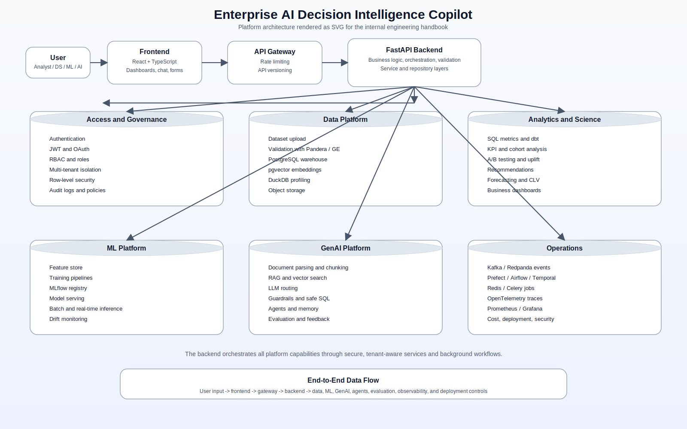

Rendered SVG diagram for the end-to-end platform architecture.


---

# Standard Chapter Template

Every major part in this handbook follows this structure:

1. **Purpose:** Why the topic exists.
2. **Business Importance:** Why companies need it.
3. **Real-World Examples:** How companies use it.
4. **Concepts:** Beginner-level explanation.
5. **Architecture:** How it fits into the platform.
6. **Tools:** Tools used and why.
7. **Alternatives:** Other tools and when to use them.
8. **Implementation Guide:** How to build it.
9. **Best Practices:** Industry standards.
10. **Common Mistakes:** What beginners often do wrong.
11. **Interview Questions:** Questions to prepare for.
12. **Learning Resources:** What to study.
13. **Deliverables:** What must be completed before moving on.

---

# Part 1: Business Overview

## Purpose

The business purpose of the platform is to help organizations convert raw data and internal knowledge into decisions. Most companies have useful data spread across databases, CSV files, spreadsheets, dashboards, documents, PDFs, CRMs, transaction systems, and cloud applications. The challenge is that business teams often cannot access, understand, or act on this information quickly.

The platform solves this by combining:

- Business intelligence
- Data engineering
- Data science
- Machine learning
- Forecasting
- Recommendation systems
- RAG
- Agentic AI
- MLOps
- Governance

## Business Importance

Companies need decision intelligence because manual reporting is slow, inconsistent, and hard to scale. A marketing analyst should not wait days for a SQL query. A fraud analyst should not manually inspect thousands of transactions. A healthcare operations team should not rely only on spreadsheets to plan capacity.

The platform helps answer questions such as:

- Which customers are likely to churn?
- Which transactions look fraudulent?
- Which campaign created measurable lift?
- Which patients may miss appointments?
- Which products should be recommended?
- Why did revenue drop last week?
- Which document supports this answer?
- Can this model prediction be trusted?

## Real-World Examples

Healthcare and public health:

- Predict appointment no-shows.
- Monitor public health trends.
- Analyze resource utilization.

BFSI:

- Predict loan default risk.
- Detect suspicious transactions.
- Support AML monitoring.

Retail and e-commerce:

- Segment customers.
- Forecast demand.
- Recommend products.

Marketing and advertising:

- Measure campaign ROI.
- Score leads.
- Run A/B tests.

## Concepts

A decision intelligence system has four layers:

1. **Data layer:** Stores raw and processed data.
2. **Analytics layer:** Produces dashboards and KPIs.
3. **Intelligence layer:** Produces predictions, recommendations, forecasts, and LLM answers.
4. **Action layer:** Helps users decide what to do next.

## Architecture

The project uses domain packs. A domain pack is a configuration package that defines the entities, metrics, models, dashboards, prompts, and evaluation rules for a business domain.

Example:

```yaml
domain: retail
entities:
  - customer
  - order
  - product
  - campaign
metrics:
  - revenue
  - churn_rate
  - repeat_purchase_rate
ml_tasks:
  - churn_prediction
  - demand_forecasting
  - product_recommendation
```

## Tools

| Tool | Why It Is Used |
|---|---|
| FastAPI | Backend APIs. |
| PostgreSQL | Reliable structured data store. |
| pgvector | Vector search for RAG. |
| React | Web interface. |
| MLflow | Experiment tracking and model registry. |
| LangGraph | Agent workflows. |
| Docker | Consistent local environment. |
| Azure | Cloud deployment target. |

## Alternatives

| Need | Primary Choice | Alternatives |
|---|---|---|
| Backend | FastAPI | Django, Flask, Spring Boot |
| Database | PostgreSQL | MySQL, SQL Server |
| Vector Search | pgvector | Qdrant, Weaviate, Pinecone |
| ML Tracking | MLflow | Weights & Biases, Neptune |
| Agents | LangGraph | Semantic Kernel, AutoGen |
| Cloud | Azure | AWS, GCP |

## Implementation Guide

Start with a retail use case because retail data is easy to understand. Design the platform so healthcare, BFSI, and marketing can be added using domain packs.

Implementation order:

1. Create repository.
2. Add FastAPI backend.
3. Add React frontend.
4. Add PostgreSQL.
5. Add authentication.
6. Add organization and tenant model.
7. Add dataset upload.
8. Add validation.
9. Add dashboard metrics.
10. Add first ML model.
11. Add document ingestion.
12. Add basic RAG.
13. Add copilot chat.

## Best Practices

- Start with one domain and one use case.
- Keep domain logic configurable.
- Do not hardcode metrics inside route handlers.
- Version datasets and models.
- Add security from day one.
- Treat prompts as production assets.
- Track costs and latency.

## Common Mistakes

- Trying to build all domains first.
- Building notebooks instead of services.
- Ignoring data validation.
- Allowing unsafe SQL.
- Not tracking model versions.
- Creating a chatbot without citations.
- Ignoring user permissions.

## Interview Questions

1. What business problem does this platform solve?
2. Why design it as a multi-domain system?
3. What is a domain pack?
4. How does the system combine BI, ML, and GenAI?
5. How do you make LLM answers trustworthy?

## Learning Resources

Study:

- Business intelligence basics
- Product requirements documents
- Data analytics lifecycle
- ML lifecycle
- RAG architecture
- Enterprise software architecture

## Deliverables

- One-page business summary
- Domain list
- User personas
- Use case matrix
- High-level architecture diagram
- Glossary

---

# Part 2: Product Vision

## Purpose

The product vision defines the long-term direction of the platform.

Vision statement:

> Build a secure, multi-domain AI decision intelligence platform that converts structured data and unstructured documents into dashboards, predictions, forecasts, recommendations, cited answers, and agent-assisted decisions.

## Business Importance

A clear product vision prevents disconnected feature development. Without it, one engineer may build dashboards, another may build notebooks, another may build a chatbot, and another may build a model registry. The vision connects these components into one product.

## Real-World Examples

Similar product categories in industry include:

- BI platforms such as Power BI and Tableau
- Data platforms such as Databricks
- ML platforms such as DataRobot and Azure ML
- Enterprise knowledge copilots
- Internal decision support systems

## Concepts

A product vision answers:

- Who is the product for?
- What problem does it solve?
- What outcomes does it create?
- Why is it different from existing workflows?
- How will users trust the results?

Primary users:

- Business analyst
- Data analyst
- Data scientist
- ML engineer
- AI engineer
- Compliance officer
- Department manager
- Platform administrator

## Architecture

| Product Capability | Technical Module |
|---|---|
| Upload data | Dataset service |
| Validate data | Validation service |
| Generate dashboards | Analytics service |
| Train models | ML service |
| Run forecasts | Forecasting service |
| Ask document questions | RAG service |
| Route complex work | Agent service |
| Evaluate quality | Evaluation service |
| Control access | Auth and governance service |

## Tools

| Tool | Product Role |
|---|---|
| React | User experience. |
| FastAPI | Product backend. |
| PostgreSQL | Source of truth. |
| MLflow | Model lifecycle. |
| LangGraph | Copilot workflows. |
| pgvector | Retrieval. |
| Prometheus/Grafana | Monitoring. |
| Azure | Enterprise hosting. |

## Alternatives

The product could be:

1. A dashboard tool only.
2. An ML model platform only.
3. A RAG chatbot only.
4. An agent platform only.
5. A complete decision intelligence platform.

This project chooses option 5 because it provides the strongest learning and enterprise architecture value.

## Implementation Guide

Write the PRD first. The PRD must include:

- Problem statement
- Target users
- Use cases
- User journeys
- Success metrics
- Functional requirements
- Non-functional requirements
- Risks
- Out-of-scope items
- Roadmap

## Best Practices

- Write user stories before coding.
- Define success metrics.
- Separate MVP from future scope.
- Avoid vague requirements.
- Build demo scenarios early.

## Common Mistakes

- Building technology for its own sake.
- Not defining the user.
- Not defining measurable success.
- Confusing prototype features with production features.

## Interview Questions

1. What is the product vision?
2. Who are the users?
3. What is the MVP?
4. How would you prioritize features?
5. How would you explain the product to a business stakeholder?

## Learning Resources

Study:

- Product management basics
- User stories
- Agile planning
- Enterprise AI products
- Business process mapping

## Deliverables

- PRD v1
- User persona document
- MVP definition
- Future scope list
- Success metrics

---

# Part 3: Business Requirements

## Purpose

Business requirements describe what outcomes the organization needs. They should not describe implementation details.

Bad requirement:

> Build an XGBoost model.

Good requirement:

> Help risk analysts identify loan applicants with high default risk and explain the top drivers behind each score.

## Business Importance

Business requirements ensure the platform solves real problems. They also help teams avoid building features that look impressive but do not affect decisions.

## Real-World Examples

| Domain | Business Requirement |
|---|---|
| Healthcare | Reduce missed appointments using predictive risk scoring. |
| BFSI | Reduce fraud losses using transaction anomaly detection. |
| Retail | Increase retention using churn prediction and recommendations. |
| Marketing | Improve campaign ROI using uplift analysis. |

## Concepts

Each business requirement should include:

- Business goal
- User role
- Business process
- Input data
- Expected decision
- Success metric
- Constraints
- Risks

## Architecture

Business requirements are implemented through domain packs and services. Domain packs define what metrics, models, and workflows are relevant for each industry.

## Tools

| Tool | Requirement Supported |
|---|---|
| SQL/dbt | Metrics and reporting. |
| ML models | Prediction and scoring. |
| RAG | Policy and document Q&A. |
| Agents | Multi-step workflows. |
| Audit logs | Compliance. |
| Dashboards | Decision support. |

## Alternatives

Business requirements can be documented in:

- Markdown
- Confluence
- Notion
- Jira epics
- Azure DevOps

Use Markdown in this project so requirements stay close to code.

## Implementation Guide

Create `docs/business-requirements.md` with one section per domain.

Example:

```md
## Retail Churn Reduction

Business goal:
Reduce customer churn.

User:
Marketing analyst.

Input data:
Customers, orders, campaigns, web events.

Expected output:
Churn score, explanation, and retention target list.

Success metric:
Increase retention campaign conversion rate.
```

## Best Practices

- Use business language.
- Tie every requirement to a user.
- Define measurable outcomes.
- Document assumptions.
- Review requirements before implementation.

## Common Mistakes

- Writing tools as requirements.
- Missing success metrics.
- Ignoring data availability.
- Not identifying the decision owner.

## Interview Questions

1. How do you convert a business problem into an ML problem?
2. What is the difference between business and functional requirements?
3. How do you validate business value?

## Learning Resources

Study:

- Requirements engineering
- Business analysis
- KPI design
- ML problem framing

## Deliverables

- Business requirements document
- Domain use case matrix
- KPI catalog
- Success metric definitions

---

# Part 4: Functional Requirements

## Purpose

Functional requirements describe what the system must do.

## Business Importance

Functional requirements turn business goals into buildable features.

Example:

Business need:

> Analysts need to understand churn risk.

Functional requirements:

- Upload customer data.
- Train churn model.
- Show churn probability.
- Show SHAP explanation.
- Export high-risk customer list.

## Real-World Examples

Common enterprise features:

- User login
- Data upload
- File validation
- Dashboard generation
- Model training
- Prediction APIs
- Document search
- Chat interface
- Admin panel
- Audit log export

## Concepts

Functional requirements should include:

- Actor
- Trigger
- Input
- System behavior
- Output
- Error behavior
- Permission rules

Example:

> As a data analyst, I want to upload a CSV file so that I can generate a data quality report.

## Architecture

| Requirement | Service |
|---|---|
| Login | Auth service |
| Upload file | Dataset service |
| Validate data | Validation service |
| Dashboard | Analytics service |
| Train model | ML service |
| Ask question | Copilot service |
| Search documents | RAG service |
| Monitor drift | MLOps service |

## Tools

| Tool | Functional Role |
|---|---|
| FastAPI | APIs |
| React | UI |
| PostgreSQL | Persistence |
| Celery | Background work |
| Redis | Queue and cache |
| MLflow | Model tracking |
| LangGraph | Agent workflows |

## Alternatives

Requirements can be managed in:

- GitHub Issues
- Jira
- Linear
- Azure DevOps
- Markdown checklists

## Implementation Guide

Create feature tickets for:

- Authentication
- Organization management
- Dataset upload
- Schema mapping
- Data validation
- Dashboard metrics
- ML training
- Prediction serving
- RAG ingestion
- Chat interface
- Agent routing
- Evaluation dashboard
- Admin screens

Each ticket should include:

- Description
- Acceptance criteria
- API endpoints
- UI changes
- Database changes
- Tests

## Best Practices

- Keep requirements testable.
- Define acceptance criteria.
- Include error cases.
- Include permissions.
- Include audit requirements.

## Common Mistakes

- Vague requirements.
- No edge cases.
- No permission rules.
- No acceptance criteria.
- No tests.

## Interview Questions

1. What is a user story?
2. What is acceptance criteria?
3. How do you convert requirements into APIs?

## Learning Resources

Study:

- User stories
- Acceptance criteria
- API design
- Test-driven development basics

## Deliverables

- Functional requirements document
- User stories
- Acceptance criteria
- Feature backlog
- MVP scope

---

# Part 5: Non-Functional Requirements

## Purpose

Non-functional requirements describe system quality: performance, security, reliability, scalability, observability, maintainability, compliance, and cost.

## Business Importance

A system can have all features and still fail if it is slow, insecure, unreliable, or too expensive.

## Real-World Examples

- CRUD APIs should respond quickly.
- Long-running ML jobs should run asynchronously.
- Dataset access must be tenant-scoped.
- LLM token usage must be tracked.
- Sensitive actions must produce audit logs.

## Concepts

| Category | Meaning |
|---|---|
| Performance | How fast the system is. |
| Scalability | Whether the system can handle growth. |
| Security | Protection from unauthorized access. |
| Reliability | Whether the system works consistently. |
| Availability | Whether the system is reachable. |
| Maintainability | Whether engineers can change it safely. |
| Observability | Whether system behavior is understandable. |
| Compliance | Whether the system follows legal and policy rules. |
| Cost | Whether the system is financially manageable. |

## Architecture

Non-functional requirements affect every layer. Security affects APIs, database, frontend, RAG, and agents. Observability affects backend, ML, LLM calls, and background jobs. Scalability affects queues, workers, storage, and cloud deployment.

## Tools

| Requirement | Tools |
|---|---|
| Performance | FastAPI, Redis, database indexes |
| Scalability | Kubernetes, Celery, Kafka |
| Security | JWT, RBAC, RLS, Azure Key Vault |
| Observability | OpenTelemetry, Prometheus, Grafana |
| Reliability | Retries, timeouts, queues |
| Cost control | Token tracking, budget alerts |

## Alternatives

Observability alternatives:

- Datadog
- New Relic
- Azure Monitor
- Grafana Cloud

Queue alternatives:

- Celery
- Dramatiq
- RQ

## Implementation Guide

Define measurable targets:

```md
Performance:
- CRUD APIs under 300 ms p95.
- Dashboard APIs under 2 seconds p95.
- LLM chat streams responses.

Security:
- All APIs require auth except health checks.
- All data is tenant-scoped.
- Sensitive actions create audit logs.

Observability:
- Every request has a trace ID.
- Every LLM call logs model, tokens, cost, and latency.
```

## Best Practices

- Track p95 and p99 latency.
- Add timeouts to external calls.
- Never log secrets.
- Add indexes for frequent queries.
- Make background jobs idempotent.
- Monitor cost from day one.

## Common Mistakes

- Ignoring non-functional requirements until production.
- No timeouts.
- Logging sensitive data.
- No tenant isolation tests.
- No LLM cost monitoring.

## Interview Questions

1. What are non-functional requirements?
2. How do you measure API performance?
3. How do you design for scalability?
4. How do you monitor LLM cost?

## Learning Resources

Study:

- System design
- API performance
- Cloud security
- Observability
- Distributed systems basics

## Deliverables

- NFR document
- Performance targets
- Security checklist
- Observability targets
- Cost targets
- Reliability checklist

---

# Part 6: Domain Understanding

## Purpose

Domain understanding means learning the business context before designing models or features. A model is useful only if it solves the right business problem.

## Business Importance

Different industries use different language, data, regulations, and success metrics. A churn model for retail is not the same as a default model for banking or a no-show model for healthcare.

## Real-World Examples

| Domain | Example Decision |
|---|---|
| Healthcare | Which appointments are likely to be missed? |
| BFSI | Which transactions are suspicious? |
| Retail | Which customers are likely to churn? |
| Marketing | Which campaign caused the most lift? |

## Concepts

A domain pack defines:

- Entities
- Relationships
- Datasets
- Metrics
- Models
- Dashboards
- Compliance requirements
- Prompts
- Evaluation rules

## Architecture

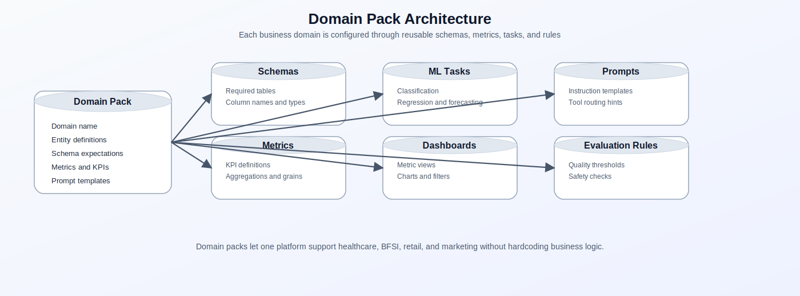

Rendered SVG diagram for the domain-pack configuration model.


## Domain Details

### Healthcare and Public Health

Use cases:

- Appointment no-show prediction
- Public health trend monitoring
- Resource utilization
- Billing anomaly detection
- Policy Q&A
- PII masking

Important caution: This project should not present healthcare outputs as clinical diagnosis. It should focus on operational analytics.

### BFSI

Use cases:

- Credit scoring
- Loan default prediction
- Fraud detection
- AML monitoring
- Claim anomaly detection
- Risk segmentation
- Regulatory document Q&A

Important caution: BFSI models require strong explainability, auditability, and fairness awareness.

### Retail and E-commerce

Use cases:

- Churn prediction
- Demand forecasting
- Product recommendation
- RFM segmentation
- Basket analysis
- Campaign analytics
- Inventory risk

### Marketing and Advertising

Use cases:

- Lead scoring
- Conversion prediction
- Campaign ROI
- Uplift analysis
- A/B testing
- Attribution analysis
- Creative performance analysis

## Tools

| Tool | Domain Use |
|---|---|
| YAML/JSON | Store domain configs. |
| Pydantic | Validate configs. |
| PostgreSQL | Store domain metadata. |
| React | Domain-specific UI. |
| LangGraph | Domain-aware workflows. |

## Alternatives

Domain configuration can live in:

- YAML files
- JSON files
- Database tables
- Python classes
- Admin-managed records

Use YAML first. Move to database-backed configs later.

## Implementation Guide

Create:

```text
backend/app/domain_packs/configs/retail.yaml
backend/app/domain_packs/configs/bfsi.yaml
backend/app/domain_packs/configs/healthcare.yaml
backend/app/domain_packs/configs/marketing.yaml
```

Example:

```yaml
domain: retail
display_name: Retail and E-commerce
entities:
  - customer
  - order
  - product
  - campaign
required_datasets:
  - customers
  - orders
  - products
metrics:
  - revenue
  - repeat_purchase_rate
  - churn_rate
ml_tasks:
  - churn_prediction
  - demand_forecasting
  - recommendation
```

## Best Practices

- Keep domain definitions explicit.
- Version domain packs.
- Do not hardcode retail logic into generic services.
- Include sample datasets.
- Document assumptions.

## Common Mistakes

- Building models before defining targets.
- Using one schema for every domain.
- Ignoring compliance differences.
- Hardcoding metrics.

## Interview Questions

1. What is domain understanding?
2. Why do ML projects fail without domain knowledge?
3. What is a domain pack?
4. How do you design a multi-domain platform?

## Learning Resources

Study:

- Healthcare operations analytics
- Credit risk and fraud analytics
- Retail analytics
- Marketing analytics
- Domain-driven design

## Deliverables

- Four domain pack YAML files
- Domain glossary
- Domain use case matrix
- Sample datasets
- Domain assumptions document

---

# Part 7: System Architecture

## Purpose

System architecture explains how all parts of the platform fit together.

## Business Importance

A strong architecture allows teams to build features independently while keeping the system coherent, secure, and scalable.

## Real-World Examples

Architecture documents help companies:

- Onboard engineers
- Review security risks
- Plan cloud deployment
- Estimate cost
- Debug production incidents
- Define service ownership

## Concepts

| Concept | Explanation |
|---|---|
| Service | Module responsible for one capability. |
| API | Interface for communication. |
| Database | Persistent storage. |
| Queue | Background job system. |
| Event | Message that something happened. |
| Workflow | Multi-step process. |
| Tenant | Customer organization using the system. |

## Architecture


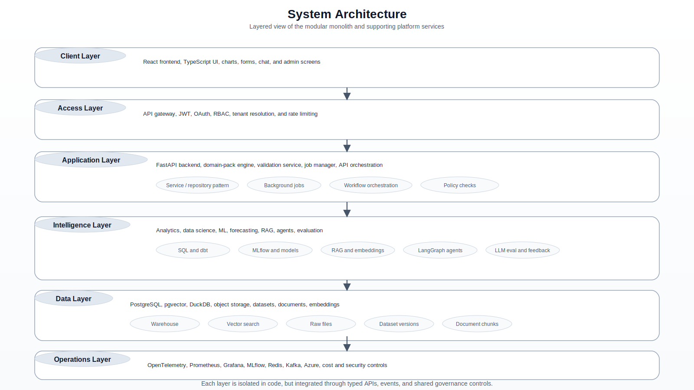

Rendered SVG diagram for the layered system architecture.

## Tools

| Layer | Tools |
|---|---|
| Client | React, TypeScript, TailwindCSS |
| Access | API Gateway, JWT, OAuth |
| Backend | FastAPI, Pydantic |
| Data | PostgreSQL, pgvector, DuckDB |
| ML | scikit-learn, XGBoost, MLflow |
| RAG | embeddings, pgvector, rerankers |
| Agents | LangGraph |
| Operations | Docker, Kubernetes, OpenTelemetry |

## Alternatives

Architecture styles:

- Monolith
- Modular monolith
- Microservices
- Serverless
- Event-driven architecture

Recommended: Start with a modular monolith.

## Implementation Guide

Recommended backend modules:

```text
backend/app/
  api/
  core/
  auth/
  tenants/
  datasets/
  validation/
  analytics/
  data_science/
  ml/
  forecasting/
  recommendations/
  rag/
  llm/
  agents/
  evals/
  observability/
  security/
  db/
```

## Best Practices

- Keep module boundaries clear.
- Avoid circular imports.
- Use dependency injection.
- Document architecture decisions.
- Separate domain logic from infrastructure.

## Common Mistakes

- Building microservices too early.
- Mixing database access into route handlers.
- Hardcoding configuration.
- Ignoring authentication until late.

## Interview Questions

1. Why choose a modular monolith first?
2. How would you split this into microservices later?
3. What are the main layers?
4. How does data flow from upload to dashboard?

## Learning Resources

Study:

- Clean architecture
- Domain-driven design basics
- System design fundamentals
- Distributed systems basics

## Deliverables

- Architecture diagram
- Module boundary document
- Data flow diagrams
- ADRs
- Repository skeleton

---

# Part 8: Backend Architecture

## Purpose

The backend exposes APIs, enforces security, runs business logic, talks to databases, launches jobs, and integrates with ML and LLM services.

## Business Importance

The backend is the reliability and security center of the platform.

## Real-World Examples

Backend APIs support:

- Uploading datasets
- Starting validation jobs
- Fetching dashboard metrics
- Training models
- Running predictions
- Asking copilot questions
- Viewing audit logs

## Concepts

| Concept | Explanation |
|---|---|
| Route | URL endpoint such as `/api/v1/datasets`. |
| Request | Data sent from client to server. |
| Response | Data returned by server. |
| Schema | Expected structure of data. |
| Service | Business logic layer. |
| Repository | Database access layer. |
| Middleware | Code that runs around requests. |
| Dependency Injection | Supplying dependencies instead of hardcoding them. |

## Architecture

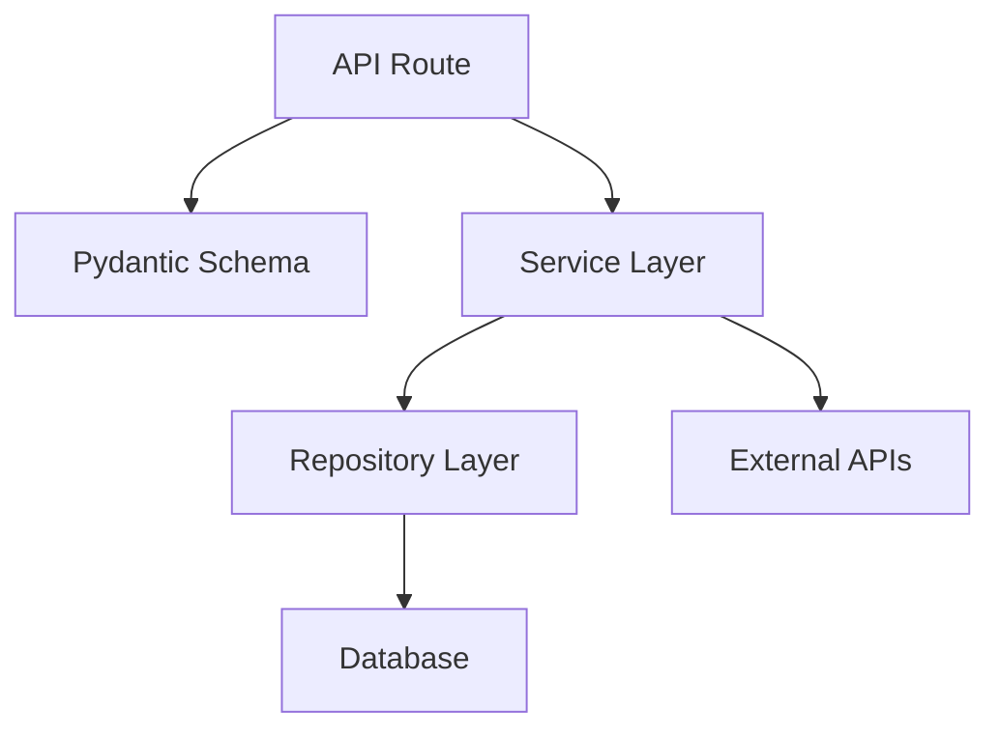
```mermaid
flowchart TD
    Route["API Route"]
    Schema["Pydantic Schema"]
    Service["Service Layer"]
    Repo["Repository Layer"]
    DB["Database"]
    External["External APIs"]

    Route --> Schema
    Route --> Service
    Service --> Repo
    Repo --> DB
    Service --> External
```

## Tools

| Tool | Why Used |
|---|---|
| FastAPI | High-performance Python APIs. |
| Pydantic | Request and response validation. |
| SQLAlchemy | ORM for database access. |
| Alembic | Database migrations. |
| pytest | Automated testing. |
| Ruff | Linting and formatting. |
| mypy | Type checking. |

## Alternatives

| Tool | Alternatives |
|---|---|
| FastAPI | Django REST Framework, Flask |
| SQLAlchemy | Django ORM, Tortoise ORM |
| Alembic | Flyway, Liquibase |
| pytest | unittest |
| Pydantic | Marshmallow |

## Implementation Guide

Recommended module structure:

```text
datasets/
  routes.py
  schemas.py
  models.py
  service.py
  repository.py
  exceptions.py
  tests/
```

Example route:

```python
from fastapi import APIRouter, Depends
from app.datasets.schemas import DatasetResponse
from app.datasets.service import DatasetService

router = APIRouter(prefix="/datasets", tags=["datasets"])

@router.get("/{dataset_id}", response_model=DatasetResponse)
def get_dataset(dataset_id: str, service: DatasetService = Depends()):
    return service.get_dataset(dataset_id)
```

## Best Practices

- Keep route handlers thin.
- Put business logic in services.
- Put database queries in repositories.
- Validate all inputs.
- Use typed schemas.
- Add structured errors.
- Add tests for workflows.

## Common Mistakes

- Putting all logic in route functions.
- Returning raw ORM objects.
- Not handling errors.
- Not using migrations.
- Logging secrets.

## Interview Questions

1. Why use FastAPI?
2. What is Pydantic?
3. What is SQLAlchemy?
4. How do you structure backend modules?

## Learning Resources

Study:

- FastAPI tutorial
- Pydantic
- SQLAlchemy ORM
- Alembic migrations
- REST API design

## Deliverables

- Backend skeleton
- Health check endpoint
- Auth endpoints
- Dataset endpoints
- Service/repository pattern
- Tests
- OpenAPI documentation

---

# Part 9: Frontend Architecture

## Purpose

The frontend is the browser application users interact with. It lets users upload data, view dashboards, train models, ask questions, inspect citations, review agent traces, and manage administration.

## Business Importance

The frontend turns complex data and AI workflows into usable product experiences.

## Real-World Examples

Frontend screens include:

- Login
- Dataset upload
- Schema mapping
- Data quality report
- KPI dashboards
- Model training
- Copilot chat
- Citation viewer
- Agent workflow visualization
- Admin user management

## Concepts

| Concept | Explanation |
|---|---|
| Component | Reusable UI block. |
| Page | Full route screen. |
| State | Data remembered by UI. |
| API client | Code that calls backend. |
| Form validation | Checking input before submission. |
| Streaming UI | Showing LLM output as it arrives. |
| Charting | Visual display of metrics. |

## Architecture

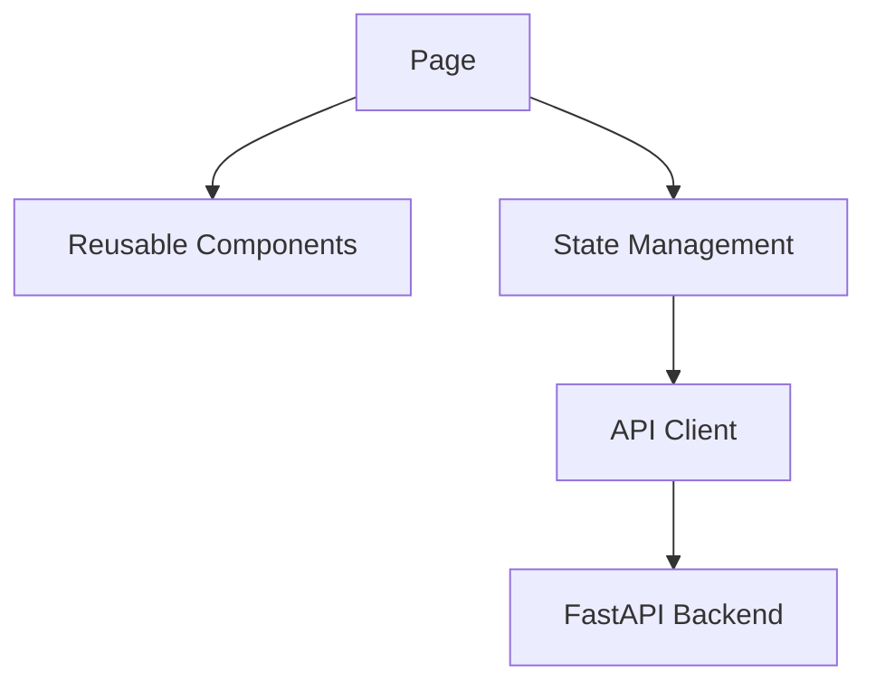
```mermaid
flowchart TD
    Page["Page"]
    Component["Reusable Components"]
    State["State Management"]
    API["API Client"]
    Backend["FastAPI Backend"]

    Page --> Component
    Page --> State
    State --> API
    API --> Backend
```

## Tools

| Tool | Why Used |
|---|---|
| React | Component-based UI. |
| TypeScript | Safer JavaScript. |
| TailwindCSS | Fast styling. |
| Recharts | Charts. |
| React Query | API state management. |
| Zod | Frontend validation. |
| WebSockets/SSE | Real-time updates. |

## Alternatives

| Need | Primary | Alternatives |
|---|---|---|
| UI framework | React | Vue, Angular, Svelte |
| Styling | TailwindCSS | CSS Modules, Material UI |
| Charts | Recharts | ECharts, Chart.js, Plotly |
| API state | React Query | SWR, Redux Toolkit Query |

## Implementation Guide

Recommended structure:

```text
frontend/src/
  app/
  components/
  features/
    auth/
    datasets/
    dashboards/
    ml/
    rag/
    agents/
    evals/
    admin/
  services/
  types/
```

Build screens in this order:

1. Login
2. Organization dashboard
3. Domain selector
4. Dataset upload
5. Data quality report
6. Dashboard
7. Model training
8. Copilot chat
9. Agent trace viewer
10. Admin users

## Best Practices

- Keep components small.
- Use typed API responses.
- Show loading states.
- Show error states.
- Show citations clearly.
- Show confidence and limitations.
- Do not hide backend permission failures.

## Common Mistakes

- No error states.
- No form validation.
- No loading states.
- Hardcoding domain logic.
- Not showing citation sources.

## Interview Questions

1. Why use TypeScript?
2. How do you structure React apps?
3. How do you stream LLM responses?
4. How do you visualize agent workflows?

## Learning Resources

Study:

- React
- TypeScript
- TailwindCSS
- React Query
- Recharts
- Accessibility basics

## Deliverables

- Frontend skeleton
- Auth screens
- Dataset upload UI
- Dashboard UI
- Chat UI
- Admin UI
- API client

---

# Part 10: Database Design

## Purpose

Database design defines how data is stored, related, queried, secured, and evolved.

## Business Importance

Poor database design causes slow dashboards, incorrect metrics, duplicated data, data leaks, and hard-to-maintain code.

## Real-World Examples

The database stores:

- Organizations
- Users
- Roles
- Datasets
- Dataset versions
- Documents
- Embeddings
- Models
- Predictions
- Forecasts
- Chat sessions
- Agent traces
- Audit logs

## Concepts

| Concept | Explanation |
|---|---|
| Table | Collection of records. |
| Row | One record. |
| Column | One field. |
| Primary Key | Unique identifier. |
| Foreign Key | Link to another table. |
| Index | Speeds up queries. |
| Migration | Controlled schema change. |
| Transaction | Group of operations that succeed or fail together. |
| RLS | Row-Level Security. |

## Architecture

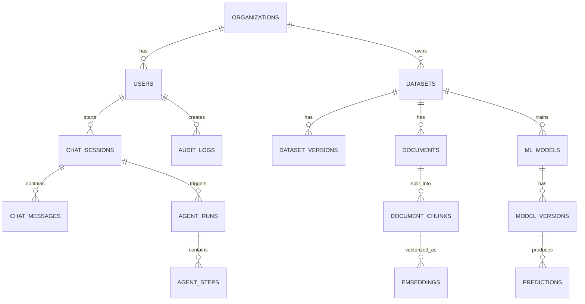
```mermaid
erDiagram
    ORGANIZATIONS ||--o{ USERS : has
    ORGANIZATIONS ||--o{ DATASETS : owns
    DATASETS ||--o{ DATASET_VERSIONS : has
    DATASETS ||--o{ DOCUMENTS : has
    DOCUMENTS ||--o{ DOCUMENT_CHUNKS : split_into
    DOCUMENT_CHUNKS ||--o{ EMBEDDINGS : vectorized_as
    DATASETS ||--o{ ML_MODELS : trains
    ML_MODELS ||--o{ MODEL_VERSIONS : has
    MODEL_VERSIONS ||--o{ PREDICTIONS : produces
    USERS ||--o{ CHAT_SESSIONS : starts
    CHAT_SESSIONS ||--o{ CHAT_MESSAGES : contains
    CHAT_SESSIONS ||--o{ AGENT_RUNS : triggers
    AGENT_RUNS ||--o{ AGENT_STEPS : contains
    USERS ||--o{ AUDIT_LOGS : creates
```

## Tools

| Tool | Why Used |
|---|---|
| PostgreSQL | Reliable relational database. |
| pgvector | Vector search inside PostgreSQL. |
| SQLAlchemy | Python ORM. |
| Alembic | Schema migrations. |
| DuckDB | Fast analytical profiling. |

## Alternatives

| Need | Primary | Alternatives |
|---|---|---|
| Relational DB | PostgreSQL | MySQL, SQL Server |
| Vector search | pgvector | Qdrant, Pinecone, Weaviate |
| Analytics engine | DuckDB | Spark, BigQuery |
| Migration | Alembic | Flyway, Liquibase |

## Implementation Guide

Core tables:

```text
organizations
users
roles
permissions
user_roles
datasets
dataset_versions
dataset_columns
dataset_permissions
data_quality_reports
domain_packs
documents
document_chunks
embeddings
features
feature_sets
experiments
ml_models
model_versions
model_deployments
predictions
forecasts
recommendations
ab_tests
causal_analyses
agent_runs
agent_steps
chat_sessions
chat_messages
llm_calls
prompts
prompt_versions
eval_runs
eval_cases
feedback
audit_logs
drift_reports
cost_usage
workflow_runs
events
```

PostgreSQL extensions:

```sql
CREATE EXTENSION IF NOT EXISTS vector;
CREATE EXTENSION IF NOT EXISTS pgcrypto;
```

## Best Practices

- Use UUID primary keys.
- Add `created_at` and `updated_at`.
- Use foreign keys.
- Add indexes.
- Use migrations.
- Do not store huge files directly in PostgreSQL.
- Use RLS for tenant isolation.
- Validate all user-generated SQL.

## Common Mistakes

- No foreign keys.
- No indexes.
- No migrations.
- No dataset versioning.
- Mixed tenant data.
- No model lineage.

## Interview Questions

1. What is normalization?
2. What is an index?
3. What is a foreign key?
4. What is pgvector?
5. How would you design multi-tenant database security?

## Learning Resources

Study:

- SQL basics
- PostgreSQL
- Database normalization
- Indexing
- Alembic
- pgvector

## Deliverables

- ERD
- Initial migrations
- SQLAlchemy models
- Seed data
- RLS design
- Indexing plan

---

# Part 11: Data Engineering

## Purpose

Data engineering collects, moves, cleans, validates, transforms, and prepares data for analytics, ML, and AI systems.

## Business Importance

Most AI projects fail because the data is unreliable, not because the model is weak. Data engineering makes data trustworthy and repeatable.

## Real-World Examples

Retail:

- Load daily orders.
- Clean product catalog.
- Create customer features.

BFSI:

- Ingest transactions.
- Detect duplicate records.
- Create AML monitoring tables.

Healthcare:

- Load appointment schedules.
- Validate patient contact fields.
- Mask PII.

Marketing:

- Load campaign events.
- Join impressions, clicks, and conversions.
- Calculate ROI.

## Concepts

### SQL

SQL is the language for querying relational databases.

Example:

```sql
SELECT customer_id, SUM(order_amount) AS revenue
FROM orders
GROUP BY customer_id;
```

SQL is used for filtering, joining, aggregating, modeling, and debugging data.

### PostgreSQL

PostgreSQL is the main relational database. It stores application records, analytics tables, metadata, model records, audit logs, and embeddings through pgvector.

### DuckDB

DuckDB is an embedded analytical database. It is useful for fast CSV profiling, local analytics, and temporary transformations.

### Pandas

Pandas is a Python library for tabular data. Use it for data cleaning, exploration, feature engineering, and analysis on small to medium datasets.

### Polars

Polars is a fast DataFrame library. Use it when performance matters or datasets are larger.

### ETL

ETL means Extract, Transform, Load.

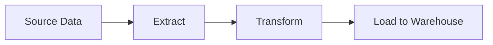
```mermaid
flowchart LR
    Source["Source Data"] --> Extract["Extract"]
    Extract --> Transform["Transform"]
    Transform --> Load["Load to Warehouse"]
```

### ELT

ELT means Extract, Load, Transform.

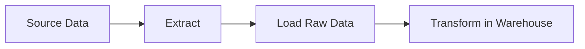
```mermaid
flowchart LR
    Source["Source Data"] --> Extract["Extract"]
    Extract --> Load["Load Raw Data"]
    Load --> Transform["Transform in Warehouse"]
```

Use ELT when the database or warehouse is strong and transformations should be version-controlled with dbt.

### Data Warehousing

A data warehouse stores clean, structured data for analytics.

Common layers:

- Raw
- Staging
- Intermediate
- Mart
- Metrics

### Data Modeling

Data modeling defines entities and relationships.

Example retail entities:

- customer
- order
- product
- campaign

### Star Schema

A star schema has a central fact table and surrounding dimension tables.

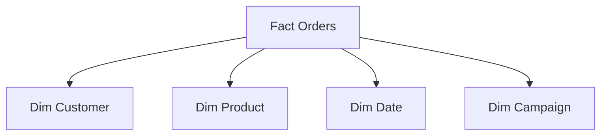
```mermaid
flowchart TD
    Fact["Fact Orders"]
    Customer["Dim Customer"]
    Product["Dim Product"]
    Date["Dim Date"]
    Campaign["Dim Campaign"]

    Fact --> Customer
    Fact --> Product
    Fact --> Date
    Fact --> Campaign
```

### Snowflake Schema

A snowflake schema normalizes dimensions into more tables.

Example:

- product
- category
- brand
- supplier

### dbt

dbt transforms raw tables into analytics-ready models using SQL. It supports testing, documentation, lineage, and version control.

### Airflow

Airflow orchestrates scheduled workflows as DAGs. It is useful for complex enterprise pipelines.

### Prefect

Prefect orchestrates Python workflows. It is often easier for Python-first data and ML pipelines.

### Kafka

Kafka streams events. Use it for real-time events such as transaction created, fraud detected, drift detected, or model trained.

### Redis

Redis is an in-memory store for cache, queues, sessions, and short-term state.

### Celery

Celery runs background jobs such as ingestion, validation, embedding generation, and model training.

### Data Validation

Data validation checks whether data is usable.

Examples:

- Required columns exist.
- IDs are not null.
- Dates are valid.
- Numeric values are within range.
- Categories are allowed.

### Great Expectations

Great Expectations defines data quality expectations and produces reports.

### Pandera

Pandera validates Pandas or Polars DataFrames using Python schemas.

## Architecture

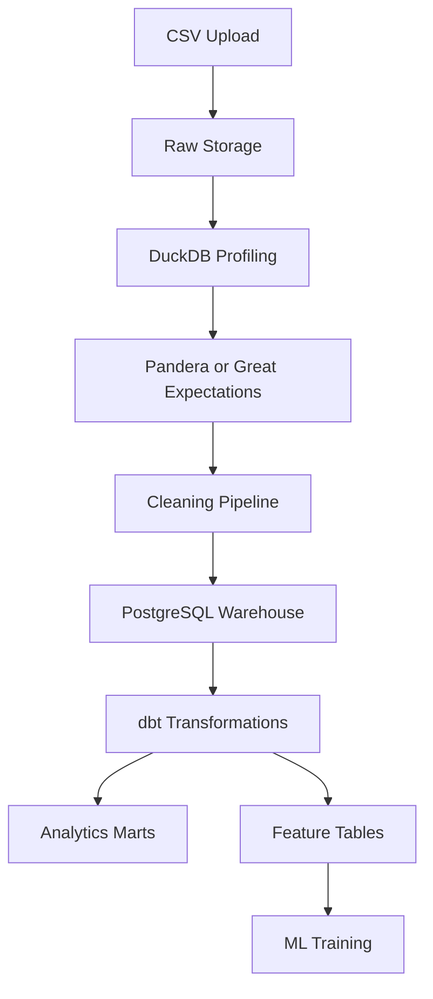
```mermaid
flowchart TD
    Upload["CSV Upload"]
    Raw["Raw Storage"]
    Profile["DuckDB Profiling"]
    Validate["Pandera or Great Expectations"]
    Clean["Cleaning Pipeline"]
    Warehouse["PostgreSQL Warehouse"]
    Transform["dbt Transformations"]
    Mart["Analytics Marts"]
    Feature["Feature Tables"]
    ML["ML Training"]

    Upload --> Raw
    Raw --> Profile
    Profile --> Validate
    Validate --> Clean
    Clean --> Warehouse
    Warehouse --> Transform
    Transform --> Mart
    Transform --> Feature
    Feature --> ML
```

## Tools

| Tool | Why It Exists | Where It Fits |
|---|---|---|
| SQL | Query structured data. | Analytics, validation, debugging. |
| PostgreSQL | Store reliable relational data. | Main database. |
| DuckDB | Fast local analytics. | CSV profiling. |
| Pandas | Data manipulation. | Cleaning and analysis. |
| Polars | Faster data processing. | Large transformations. |
| dbt | SQL transformations. | Warehouse modeling. |
| Airflow | Scheduled orchestration. | Enterprise pipelines. |
| Prefect | Python workflow orchestration. | Project pipelines. |
| Kafka | Streaming events. | Real-time architecture. |
| Redis | Cache and queue. | Background jobs. |
| Celery | Async workers. | Long-running tasks. |
| Great Expectations | Data quality. | Validation reports. |
| Pandera | DataFrame validation. | Python validation. |

## Alternatives

| Category | Primary | Alternatives |
|---|---|---|
| Database | PostgreSQL | MySQL, SQL Server |
| DataFrame | Pandas/Polars | Spark DataFrames |
| Orchestration | Prefect | Airflow, Dagster |
| Streaming | Kafka | Redpanda, Pulsar |
| Queue | Celery | RQ, Dramatiq |
| Validation | Pandera | Great Expectations, Soda |

## Implementation Guide

Build data engineering in phases:

1. File upload endpoint.
2. Store original file metadata.
3. Infer schema.
4. Validate data.
5. Produce data quality report.
6. Clean data.
7. Load to PostgreSQL.
8. Build dbt staging models.
9. Build marts.
10. Trigger feature generation.
11. Orchestrate with Prefect.
12. Move long tasks to Celery.

## Best Practices

- Keep raw data immutable.
- Version every upload.
- Validate before analytics.
- Store validation reports.
- Make pipelines idempotent.
- Separate raw, staging, and mart layers.
- Track lineage.

## Common Mistakes

- Overwriting raw data.
- No dataset versioning.
- Cleaning data without documenting rules.
- Running long jobs in HTTP requests.
- Ignoring failed validations.
- Using Pandas for data too large for memory.

## Interview Questions

1. What is ETL?
2. What is ELT?
3. Why use dbt?
4. What is a star schema?
5. What is data validation?
6. When would you use Kafka?
7. Why use Redis and Celery?
8. What is the difference between Pandas and Polars?

## Learning Resources

Study:

- SQL joins and aggregations
- PostgreSQL indexing
- Pandas
- Polars
- dbt fundamentals
- Prefect or Airflow
- Kafka basics
- Data warehousing
- Great Expectations
- Pandera

## Deliverables

- CSV upload pipeline
- Dataset versioning
- Schema inference
- Data profiling
- Validation reports
- Cleaning pipeline
- PostgreSQL loading
- dbt models
- Prefect or Airflow flow
- Celery background job
- Data quality dashboard

---

# Part 12: Analytics Engineering

## Purpose

Analytics engineering turns raw data into trusted business metrics and dashboards.

## Business Importance

Companies need consistent metrics. If revenue, churn, or conversion rate is calculated differently by every team, leaders cannot trust reports.

## Real-World Examples

Retail:

- Daily revenue
- Average order value
- Repeat purchase rate

BFSI:

- Default rate
- Fraud rate
- Approval rate

Healthcare:

- No-show rate
- Appointment volume
- Resource utilization

Marketing:

- Conversion rate
- Cost per acquisition
- Campaign ROI

## Concepts

### KPI Design

A KPI is a key performance indicator. It must have a clear formula, grain, owner, and business purpose.

### Business Metrics

Metrics are numeric measures of business behavior.

### Customer Analytics

Customer analytics studies customer acquisition, retention, churn, lifetime value, and segments.

### Cohort Analysis

A cohort is a group of users with a shared starting event. Cohort analysis tracks behavior over time.

### Funnel Analysis

Funnel analysis tracks conversion through steps.

Example:

```text
Visited -> Signed up -> Added to cart -> Purchased
```

### Retention Analysis

Retention measures whether users continue using or buying.

### Customer Lifetime Value

CLV estimates total future value from a customer.

### Campaign Analytics

Campaign analytics measures marketing performance.

### Product Analytics

Product analytics studies product usage, feature adoption, and performance.

### Power BI and Tableau

Power BI and Tableau are enterprise BI tools. The platform can expose clean data marts for these tools even if its main UI is React.

## Architecture

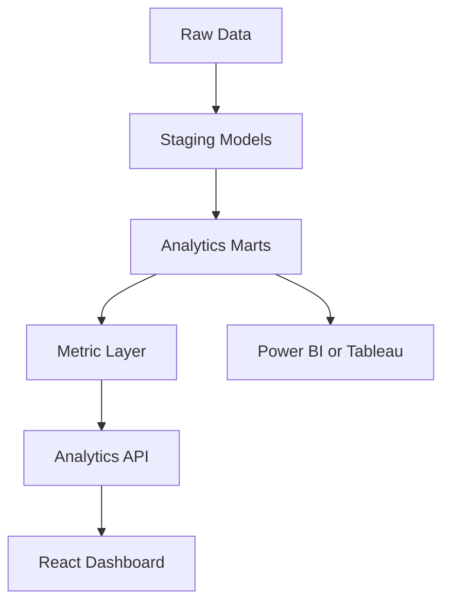
```mermaid
flowchart TD
    Raw["Raw Data"]
    Staging["Staging Models"]
    Marts["Analytics Marts"]
    Metrics["Metric Layer"]
    API["Analytics API"]
    Dashboard["React Dashboard"]
    BI["Power BI or Tableau"]

    Raw --> Staging
    Staging --> Marts
    Marts --> Metrics
    Metrics --> API
    API --> Dashboard
    Marts --> BI
```

## Tools

| Tool | Purpose |
|---|---|
| SQL | Build metrics. |
| dbt | Transform and test models. |
| PostgreSQL | Store marts. |
| React/Recharts | Dashboards. |
| Power BI | External BI. |
| Tableau | External BI. |

## Alternatives

| Need | Primary | Alternatives |
|---|---|---|
| Transformations | dbt | SQL scripts, Spark |
| Dashboard | React | Power BI, Tableau, Superset |
| Metrics layer | Custom | MetricFlow, dbt Semantic Layer |

## Implementation Guide

1. Define metric catalog.
2. Build dbt staging models.
3. Build marts.
4. Add dbt tests.
5. Create analytics APIs.
6. Build dashboard screens.
7. Add exports for BI tools.

Example metric:

```yaml
metric: average_order_value
domain: retail
formula: total_revenue / number_of_orders
grain: daily
owner: analytics
```

## Best Practices

- Define metrics in writing.
- Avoid duplicate metric logic.
- Use dbt tests.
- Add metric owners.
- Track metric changes.
- Include date grain.

## Common Mistakes

- Calculating KPIs directly from raw messy data.
- Multiple definitions of the same metric.
- No dbt tests.
- No timezone handling.

## Interview Questions

1. What is a KPI?
2. What is cohort analysis?
3. What is funnel analysis?
4. Why use dbt?
5. How do you ensure metric consistency?

## Learning Resources

Study:

- Analytics engineering
- dbt
- Business metrics
- Power BI basics
- Tableau basics
- Data visualization principles

## Deliverables

- KPI catalog
- dbt staging models
- dbt marts
- Analytics APIs
- Dashboard UI
- Cohort analysis
- Funnel analysis
- Retention dashboard

---

# Part 13: Data Science

## Purpose

Data science converts business questions into analytical, statistical, and predictive problems.

## Business Importance

Data science helps companies decide what happened, why it happened, what is likely to happen, and what action to take.

## Real-World Examples

- Retail churn prediction
- BFSI credit scoring
- Healthcare no-show prediction
- Marketing uplift analysis
- Product recommendation

## Concepts

### Problem Formulation

Convert a business problem into a data problem.

Business question:

> Which customers should receive a retention offer?

Data science problem:

> Predict whether a customer will churn in the next 60 days.

### Observation Window

Historical period used to create features.

### Performance Window

Future period used to define the target.

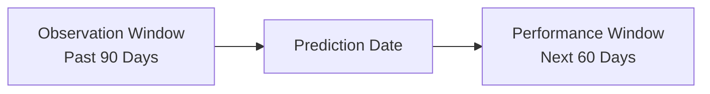
```mermaid
flowchart LR
    Obs["Observation Window<br/>Past 90 Days"]
    Cutoff["Prediction Date"]
    Perf["Performance Window<br/>Next 60 Days"]
    Obs --> Cutoff --> Perf
```

### Feature Engineering

Create input variables from data.

Examples:

- Days since last purchase
- Number of transactions
- Average order value
- Failed payment count
- Campaign clicks

### Target Variable Design

The target variable is what the model predicts.

Examples:

- churned
- defaulted
- fraud
- future revenue
- conversion

### Segmentation

Group similar users or entities.

### RFM

RFM means:

- Recency
- Frequency
- Monetary value

### K-Means

K-Means is a clustering algorithm that groups similar records.

### Churn Prediction

Predict whether a customer will stop buying or using a service.

### Classification

Predict categories such as fraud/not fraud.

### Regression

Predict numeric values such as revenue.

### Forecasting

Predict future values over time.

### A/B Testing

Compare treatment and control groups.

### Causal Inference

Estimate whether an action caused an outcome.

### Recommendation Systems

Recommend items, products, offers, or actions.

Types:

- Collaborative filtering
- Content-based filtering
- Matrix factorization
- Hybrid recommendation

## Architecture

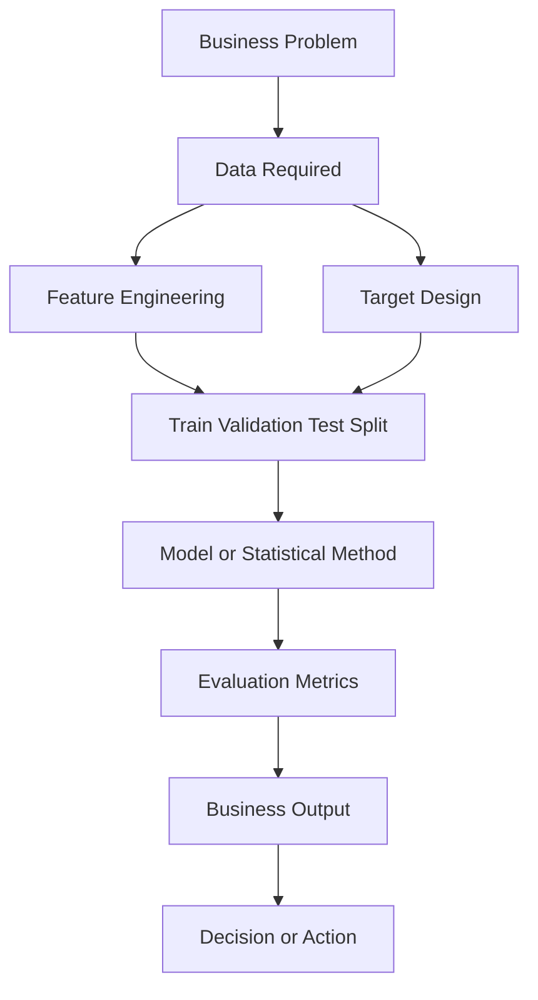
```mermaid
flowchart TD
    Business["Business Problem"]
    Data["Data Required"]
    Features["Feature Engineering"]
    Target["Target Design"]
    Split["Train Validation Test Split"]
    Model["Model or Statistical Method"]
    Metrics["Evaluation Metrics"]
    Output["Business Output"]
    Action["Decision or Action"]

    Business --> Data
    Data --> Features
    Data --> Target
    Features --> Split
    Target --> Split
    Split --> Model
    Model --> Metrics
    Metrics --> Output
    Output --> Action
```

## Use Case Specs

| Topic | Business Problem | Data Required | Features | Target | Metrics | Output |
|---|---|---|---|---|---|---|
| Churn | Identify customers likely to leave. | Customers, orders, events. | Recency, frequency, spend. | No purchase in future window. | AUC, recall, lift. | Churn score and drivers. |
| Fraud | Detect suspicious transactions. | Transactions, accounts. | Amount, velocity, location. | Fraud label. | Precision, recall, PR-AUC. | Fraud risk score. |
| Credit | Estimate default risk. | Applicants, loans, repayments. | Income, debt, history. | Default. | AUC, KS, calibration. | Credit score. |
| Forecasting | Predict demand or revenue. | Time series. | Lag values, seasonality. | Future value. | MAE, RMSE, MAPE. | Forecast chart. |
| A/B Test | Measure intervention impact. | Assignment, outcomes. | Segment attributes. | Conversion/revenue. | Lift, p-value, CI. | Experiment report. |
| Recommendation | Suggest products/offers. | Users, items, interactions. | User and item history. | Future interaction. | Precision@k, recall@k. | Top-N recommendations. |

## Tools

| Tool | Purpose |
|---|---|
| pandas | Data analysis. |
| Polars | Faster processing. |
| scipy | Statistical tests. |
| statsmodels | Statistical models. |
| scikit-learn | ML algorithms. |
| XGBoost | Strong tabular ML. |
| SHAP | Explainability. |
| lifelines | Survival analysis. |
| DoWhy/EconML | Causal inference. |

## Alternatives

| Task | Primary | Alternatives |
|---|---|---|
| Clustering | K-Means | DBSCAN, Gaussian Mixture |
| Classification | Logistic Regression/XGBoost | Random Forest, CatBoost |
| Regression | Linear Regression/XGBoost | Random Forest |
| Forecasting | Prophet/statsmodels | ARIMA, LSTM |
| Causal | DoWhy | EconML, custom tests |

## Implementation Guide

For every data science task:

1. Define business problem.
2. Define decision to improve.
3. Identify data required.
4. Define observation window.
5. Define performance window.
6. Create features.
7. Define target.
8. Split data correctly.
9. Train baseline.
10. Evaluate.
11. Explain results.
12. Convert output into user-facing report.

## Best Practices

- Start with business problem.
- Avoid target leakage.
- Use time-based splits for future prediction.
- Compare against baselines.
- Choose metrics that match the business.
- Document assumptions.

## Common Mistakes

- Using future data as features.
- Using accuracy for imbalanced fraud data.
- Confusing correlation with causation.
- Not defining churn clearly.
- Ignoring sample bias.

## Interview Questions

1. What is target leakage?
2. What is an observation window?
3. What is a performance window?
4. How do you evaluate recommendations?
5. What is uplift analysis?
6. What is causal inference?

## Learning Resources

Study:

- Practical statistics
- Customer analytics
- A/B testing
- Causal inference basics
- Recommendation systems
- SHAP explainability

## Deliverables

- EDA notebooks
- Problem specs
- Feature definitions
- Target definitions
- Baseline models
- Evaluation reports
- Recommendation pipeline
- A/B testing module
- Causal analysis report

### Survival Analysis

## Purpose

Survival analysis predicts how long it takes until an event happens. The event can be churn, default, equipment failure, re-purchase, discharge, or renewal.

This is different from ordinary classification because it keeps track of both:

- whether the event happened
- when the event happened

## Business Importance

Many enterprise problems are time-to-event problems. A company often needs to know not only who is at risk, but also when the risk is likely to materialize.

Survival analysis helps with:

- prioritizing interventions by urgency
- scheduling outreach before the event happens
- estimating customer lifetime and contract renewal risk
- forecasting operational failures or medical outcomes

## Real-World Examples

Retail:

- time to second purchase
- time to churn
- time to return

BFSI:

- time to default
- time to delinquency
- time to claim

Healthcare:

- time to readmission
- time to discharge
- time to treatment completion

Marketing:

- time to unsubscribe
- time to next conversion
- time to campaign fatigue

## Concepts

### Time-to-Event Problem

A time-to-event problem asks when something will happen. The model output is often a risk score, survival curve, or expected time.

### Censoring

Censoring means the event did not happen during the observation period, so the exact event time is unknown.

Common case:

- a customer has not churned yet
- a loan has not defaulted yet
- a patient has not had the outcome yet

### Survival Function

The survival function gives the probability that the event has not happened by time `t`.

### Hazard Function

The hazard function measures the instant risk of the event happening at time `t`, given that it has not happened before `t`.

### Kaplan-Meier

Kaplan-Meier estimates the survival curve without strong assumptions. It is a strong baseline and a good visual tool for beginners.

### Cox Proportional Hazards

The Cox model estimates how features change hazard relative to a baseline hazard. It is widely used because it is interpretable and practical.

### Time-Varying Features

Some features change over time, such as balance, usage, spend, or health status. These are useful but require careful table design.

### Evaluation Metrics

- Concordance index
- Integrated Brier score
- Calibration of risk scores
- Time-dependent AUC

## Architecture

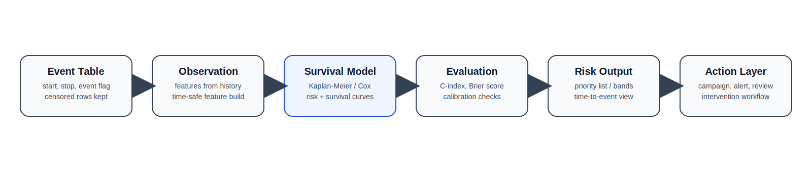

The survival pipeline is:

1. Create event table.
2. Define start time, stop time, and event flag.
3. Build features from the observation window.
4. Fit a survival model.
5. Produce survival curves and risk buckets.
6. Send high-risk users to a business action layer.

## Tools

| Tool | Purpose |
|---|---|
| lifelines | Kaplan-Meier and Cox models. |
| scikit-survival | Machine learning survival methods. |
| statsmodels | Statistical modeling support. |
| pandas | Event table preparation. |
| Polars | Fast feature preparation. |
| PostgreSQL | Store event and risk tables. |

## Alternatives

| Need | Primary | Alternatives |
|---|---|---|
| Classical survival analysis | lifelines | statsmodels, SAS |
| ML survival modeling | scikit-survival | XGBoost survival, CatBoost variants |
| Visualization | Matplotlib/Seaborn | Plotly |

## Implementation Guide

1. Define the event precisely.
2. Define the start date and end date for each subject.
3. Mark censored rows clearly.
4. Build features using only information available before the prediction date.
5. Start with Kaplan-Meier curves.
6. Fit a Cox model as the first supervised baseline.
7. Check model assumptions.
8. Score survival probabilities at multiple time horizons.
9. Expose risk bands in the UI.
10. Link the score to an intervention workflow.

## Best Practices

- Separate event definition from feature generation.
- Use time-based splits.
- Keep censored cases in the training set.
- Calibrate risk buckets for business action.
- Explain the time horizon clearly.
- Compare survival outputs against simple classification baselines.

## Common Mistakes

- Dropping censored rows.
- Treating time-to-event like ordinary regression.
- Using future information in features.
- Not defining the event window carefully.
- Ignoring proportional hazards assumptions.

## Interview Questions

1. What is censoring?
2. Why is survival analysis different from classification?
3. What does the Cox model estimate?
4. When would you use Kaplan-Meier?
5. How do you evaluate survival models?

## Learning Resources

Study:

- Kaplan-Meier estimation
- Cox proportional hazards model
- time-to-event data preparation
- censoring concepts
- scikit-survival documentation
- lifelines documentation

## Deliverables

- Event table specification
- Survival feature table
- Kaplan-Meier baseline report
- Cox model notebook
- Survival curve dashboard
- Time-to-event evaluation report
- Intervention prioritization list

---

# Part 14: Machine Learning

## Purpose

Machine learning builds models that learn patterns from data and make predictions.

## Business Importance

ML improves decisions such as risk scoring, fraud detection, churn prediction, forecasting, and recommendations.

## Real-World Examples

- Bank predicts loan default.
- Retailer predicts churn.
- Hospital predicts no-show risk.
- Marketer scores leads.
- E-commerce site recommends products.

## Concepts

### Scikit-learn

Scikit-learn is a Python library for classic ML. It provides preprocessing, pipelines, models, metrics, and validation utilities.

### XGBoost

XGBoost is a gradient boosting library that performs very well on tabular data.

### Random Forest

Random Forest trains many decision trees and combines their predictions.

### Logistic Regression

Logistic regression predicts probabilities for binary classification and is a strong interpretable baseline.

### Time Series

Time series data is ordered by time, such as daily revenue or weekly demand.

### Prophet

Prophet is a forecasting tool designed for business time series.

### LSTM

LSTM is a neural network architecture for sequence data. Use it after simpler baselines.

### Hyperparameter Tuning

Hyperparameters are model settings chosen before training, such as tree depth or learning rate.

### Cross Validation

Cross validation evaluates model performance across multiple splits.

### Model Evaluation

Evaluation measures model quality.

| Problem | Metrics |
|---|---|
| Classification | Accuracy, precision, recall, F1, AUC |
| Regression | MAE, RMSE, R2 |
| Forecasting | MAE, RMSE, MAPE |
| Recommendation | Precision@k, Recall@k, NDCG |

## Architecture

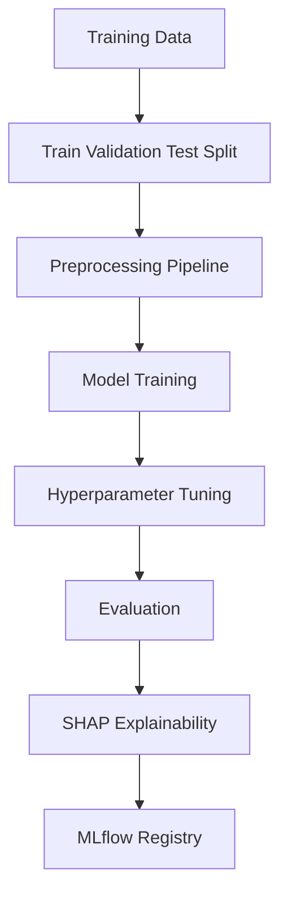
```mermaid
flowchart TD
    Data["Training Data"]
    Split["Train Validation Test Split"]
    Pipeline["Preprocessing Pipeline"]
    Model["Model Training"]
    Tune["Hyperparameter Tuning"]
    Eval["Evaluation"]
    Explain["SHAP Explainability"]
    Registry["MLflow Registry"]

    Data --> Split
    Split --> Pipeline
    Pipeline --> Model
    Model --> Tune
    Tune --> Eval
    Eval --> Explain
    Explain --> Registry
```

## Tools

| Tool | Purpose |
|---|---|
| scikit-learn | Baseline ML and pipelines. |
| XGBoost | Strong tabular models. |
| Prophet | Forecasting. |
| statsmodels | Statistical forecasting. |
| SHAP | Explainability. |
| MLflow | Experiment tracking. |

## Alternatives

| Need | Primary | Alternatives |
|---|---|---|
| Tabular ML | XGBoost | LightGBM, CatBoost |
| Forecasting | Prophet | ARIMA, ETS, LSTM |
| Explainability | SHAP | LIME |
| Tuning | Grid/Random Search | Optuna, Ray Tune |

## Implementation Guide

ML workflow:

1. Load validated dataset.
2. Define target.
3. Create features.
4. Split data.
5. Build preprocessing pipeline.
6. Train baseline model.
7. Train stronger model.
8. Evaluate metrics.
9. Generate SHAP explanations.
10. Register in MLflow.
11. Expose prediction API.

Example:

```python
from sklearn.pipeline import Pipeline
from sklearn.preprocessing import StandardScaler
from sklearn.linear_model import LogisticRegression

pipeline = Pipeline([
    ("scaler", StandardScaler()),
    ("model", LogisticRegression())
])
```

## Best Practices

- Start with a baseline.
- Use train/validation/test split.
- Use time-based splits for time problems.
- Track every experiment.
- Save preprocessing with the model.
- Evaluate on unseen data.

## Common Mistakes

- Training on all data.
- Not saving preprocessing.
- Ignoring class imbalance.
- Optimizing wrong metric.
- No baseline comparison.

## Interview Questions

1. What is overfitting?
2. What is cross-validation?
3. How does random forest work?
4. Why is XGBoost strong for tabular data?
5. What is AUC?

## Learning Resources

Study:

- scikit-learn tutorials
- XGBoost
- Model evaluation
- Cross-validation
- Forecasting basics
- SHAP

## Deliverables

- Baseline models
- XGBoost models
- Forecasting models
- Evaluation reports
- SHAP explanations
- MLflow logs
- Prediction API

---

# Part 15: ML Engineering

## Purpose

ML engineering turns notebooks into reliable production systems.

## Business Importance

A model creates value only if it can be trained, deployed, served, monitored, retrained, and rolled back.

## Real-World Examples

- Churn model scores customers nightly.
- Fraud model scores transactions in real time.
- Forecasting model runs weekly.
- Drift alert triggers retraining.

## Concepts

### ML Pipelines

Repeatable sequence:

```text
data -> features -> training -> evaluation -> registry -> deployment
```

### Feature Store

A feature store centralizes feature definitions and reduces training-serving skew.

### Model Registry

A model registry stores model versions and lifecycle stages.

### MLflow

MLflow tracks parameters, metrics, artifacts, and models.

### Model Serving

Serving makes predictions available through APIs or batch jobs.

### Batch Inference

Scores many records on a schedule.

### Real-Time Inference

Returns prediction immediately for one request.

### Drift Detection

Drift means data or model behavior changes over time.

### Evidently AI

Evidently creates drift and model monitoring reports.

### Retraining Pipelines

Retraining rebuilds models based on schedule, drift, performance drop, or manual trigger.

### Model Lineage

Lineage tracks data -> features -> model -> deployment -> prediction.

## Architecture

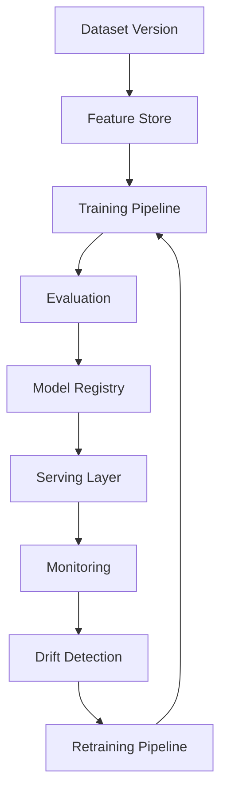
```mermaid
flowchart TD
    Dataset["Dataset Version"]
    Features["Feature Store"]
    Train["Training Pipeline"]
    Eval["Evaluation"]
    Registry["Model Registry"]
    Serve["Serving Layer"]
    Monitor["Monitoring"]
    Drift["Drift Detection"]
    Retrain["Retraining Pipeline"]

    Dataset --> Features
    Features --> Train
    Train --> Eval
    Eval --> Registry
    Registry --> Serve
    Serve --> Monitor
    Monitor --> Drift
    Drift --> Retrain
    Retrain --> Train
```

## Tools

| Tool | Purpose |
|---|---|
| MLflow | Tracking and registry. |
| Feast | Feature store. |
| FastAPI | Prediction APIs. |
| BentoML | Model packaging and serving. |
| KServe | Kubernetes-native model serving. |
| Evidently AI | Drift monitoring. |
| Prefect/Airflow | ML workflows. |

## Alternatives

| Need | Primary | Alternatives |
|---|---|---|
| Tracking | MLflow | Weights & Biases |
| Feature store | Feast | Tecton, custom tables |
| Serving | FastAPI | BentoML, Seldon, KServe |
| Monitoring | Evidently | WhyLabs, Arize |
| Pipelines | Prefect | Airflow, Kubeflow |

## Implementation Guide

1. Build feature pipeline.
2. Train with versioned dataset.
3. Log metrics to MLflow.
4. Register model.
5. Deploy model endpoint.
6. Log predictions.
7. Monitor drift.
8. Trigger retraining.
9. Compare challenger vs champion.
10. Promote or rollback.

## Best Practices

- Version datasets, features, and models.
- Track code version.
- Save preprocessing.
- Log predictions.
- Monitor drift.
- Use approval before production promotion.
- Test model APIs.

## Common Mistakes

- Serving model without preprocessing.
- No feature versions.
- No prediction logs.
- No rollback plan.
- Training-serving skew.

## Interview Questions

1. What is training-serving skew?
2. What is a feature store?
3. What is MLflow?
4. What is model drift?
5. Batch vs real-time inference?
6. How do you retrain safely?

## Learning Resources

Study:

- MLflow
- Feature stores
- Model serving
- Evidently AI
- MLOps lifecycle

## Deliverables

- ML pipeline
- Feature store design
- MLflow tracking
- Model registry
- Prediction API
- Batch inference job
- Drift report
- Retraining workflow
- Lineage dashboard

---

# Part 16: MLOps

## Purpose

MLOps manages ML systems in production by combining ML, DevOps, data engineering, monitoring, and governance.

## Business Importance

Models degrade because data changes, user behavior changes, and business processes change. MLOps keeps models reliable.

## Real-World Examples

- Fraud model retrained monthly.
- Credit model promotion requires approval.
- Churn model rollback after performance drop.
- Drift report sent to data science team.

## Concepts

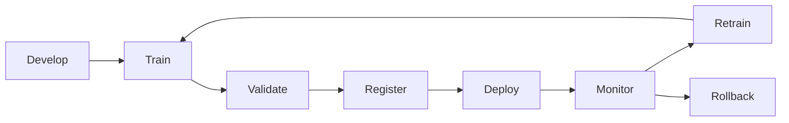
```mermaid
flowchart LR
    Develop["Develop"]
    Train["Train"]
    Validate["Validate"]
    Register["Register"]
    Deploy["Deploy"]
    Monitor["Monitor"]
    Retrain["Retrain"]
    Rollback["Rollback"]

    Develop --> Train --> Validate --> Register --> Deploy --> Monitor --> Retrain --> Train
    Monitor --> Rollback
```

MLOps lifecycle:

- Develop
- Train
- Validate
- Register
- Deploy
- Monitor
- Retrain
- Rollback

## Architecture

MLOps integrates with dataset versioning, feature store, model training, model registry, serving, drift monitoring, approvals, and audit logs.

## Expanded MLOps Topics

### Model Lifecycle Control

The production ML lifecycle is not only training and deployment. It also includes versioning, approval, monitoring, rollback, and retraining.

Core lifecycle objects:

| Object | Why It Exists |
|---|---|
| Dataset version | Identifies exactly which data trained a model. |
| Feature version | Identifies which feature definitions were used. |
| Model version | Identifies the trained artifact. |
| Deployment version | Identifies where the model is running. |
| Prediction log | Tracks what the model predicted in production. |
| Drift report | Tracks when the world changes. |
| Approval record | Shows who approved promotion. |

### Deployment Strategies

| Strategy | Meaning | When To Use |
|---|---|---|
| Rolling | Gradually replace the old version. | Normal service updates. |
| Blue-green | Keep old and new environments side by side. | Safer production promotion. |
| Canary | Route small traffic to the new version first. | High-risk model releases. |
| Shadow | New model receives traffic but does not affect users. | Comparing outputs safely. |

### Model Lineage

Model lineage means every important ML artifact can be traced back to the data and code that produced it.

Example lineage chain:

```text
raw dataset -> cleaned dataset -> feature set -> training run -> model artifact -> serving endpoint -> prediction log
```

### Cost Monitoring

MLOps also includes spend control.

Track:

- Training compute cost
- Batch inference compute cost
- Real-time inference latency cost
- LLM token cost for AI-assisted ML workflows
- Storage cost for artifacts and embeddings

### Retraining Triggers

Retraining should not happen randomly. It should be triggered by:

- Schedule
- Data drift
- Prediction drift
- Performance degradation
- New business policy
- Manual approval

### Multi-Tenant MLOps

In a multi-tenant platform, every model artifact, feature set, report, and prediction must be scoped to an organization.

That means:

- tenant-aware dataset access
- tenant-aware model registry views
- tenant-aware monitoring dashboards
- tenant-aware prediction logs
- tenant-aware retraining permissions

## Tools

| Tool | Role |
|---|---|
| MLflow | Tracking and registry. |
| Evidently AI | Drift monitoring. |
| Prefect/Airflow | Pipelines. |
| Docker | Reproducible environments. |
| GitHub Actions | CI/CD. |
| Kubernetes | Scalable deployment. |
| KServe or BentoML | Model serving. |
| PostgreSQL | Metadata, lineage, and logs. |
| Redis | Queue and short-lived state. |
| OpenTelemetry | Traces for training and inference workflows. |

## Alternatives

- Kubeflow
- Weights & Biases
- Arize
- WhyLabs
- Seldon
- KServe

## Implementation Guide

Create workflows:

1. Training workflow.
2. Evaluation workflow.
3. Registration workflow.
4. Deployment workflow.
5. Monitoring workflow.
6. Retraining workflow.
7. Rollback workflow.

Implementation notes:

- Keep the training pipeline deterministic.
- Store every artifact with a unique run ID.
- Require approval before promoting a model to production.
- Use a champion/challenger comparison before release.
- Add a rollback path before the first deployment.
- Use the same feature definitions in training and serving.

## Best Practices

- Automate repeatable steps.
- Track lineage.
- Keep human approval for high-risk models.
- Add rollback.
- Monitor data and predictions.
- Document limitations.
- Use canary or blue-green deployment for risky changes.
- Add feature flags for gradual exposure.
- Keep runtime dependencies pinned.
- Separate experiment runs from production runs.
- Test the inference API with representative payloads.

## Common Mistakes

- Treating deployment as the end.
- No monitoring.
- No retraining strategy.
- No registry.
- No reproducibility.
- No approval step before production promotion.
- Missing dataset version in model metadata.
- Training and serving use different preprocessing code.
- Ignoring cost growth after scaling.

## Interview Questions

1. What is MLOps?
2. How is MLOps different from DevOps?
3. What is challenger vs champion?
4. How do you rollback a model?
5. What is model lineage?
6. Why use canary deployment for models?

## Learning Resources

Study:

- MLOps principles
- MLflow
- Model monitoring
- Model governance
- Kubernetes serving
- Feature stores
- Model serving patterns
- ML deployment strategies

## Deliverables

- MLOps architecture
- MLflow setup
- Promotion workflow
- Drift reports
- Retraining pipeline
- Rollback runbook
- Model lineage diagram
- Deployment strategy document
- Cost dashboard
- Approval workflow

---

# Part 17: Generative AI

## Purpose

Generative AI lets the system understand and generate text, answer questions, summarize documents, call tools, and assist users through natural language.

## Business Importance

GenAI makes analytics and ML more accessible. Users can ask questions instead of writing SQL or Python.

## Real-World Examples

- Compliance analyst asks questions over policy documents.
- Marketer asks why campaign ROI dropped.
- Risk analyst asks for fraud summaries.
- Manager asks for weekly business insights.

## Concepts

### LLM Fundamentals

An LLM is a model trained on large text collections to predict and generate language.

### Transformers

Transformers use attention to understand relationships between tokens.

### Embeddings

Embeddings convert text into numeric vectors. Similar text produces nearby vectors.

### Prompt Engineering

Prompt engineering writes instructions that guide model behavior.

### Tool Calling

Tool calling lets the model request external actions such as SQL query, RAG search, or prediction.

### Function Calling

Function calling is structured tool calling with defined arguments.

### Structured Outputs

Structured outputs make the model return data matching a schema.

### Context Windows

The context window is the amount of input and output tokens the model can process.

### Tokenisation

Tokenisation splits text into smaller pieces called tokens.

## Architecture

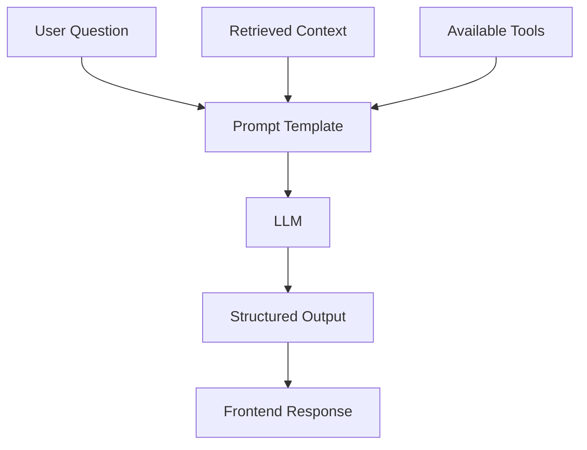
```mermaid
flowchart TD
    User["User Question"]
    Prompt["Prompt Template"]
    Context["Retrieved Context"]
    Tools["Available Tools"]
    LLM["LLM"]
    Output["Structured Output"]
    UI["Frontend Response"]

    User --> Prompt
    Context --> Prompt
    Tools --> Prompt
    Prompt --> LLM
    LLM --> Output
    Output --> UI
```

## Tools

| Tool | Purpose |
|---|---|
| OpenAI/Azure OpenAI | Hosted LLM provider. |
| Claude | Alternative hosted provider. |
| Llama/Mistral | Local or open model options. |
| Hugging Face | Model loading and fine-tuning. |
| vLLM/TGI | Local serving. |
| Pydantic | Structured output schemas. |

## Alternatives

| Need | Primary | Alternatives |
|---|---|---|
| Hosted LLM | OpenAI/Azure | Claude, Gemini |
| Local LLM | Llama/Mistral | Qwen, Mixtral |
| Serving | vLLM | TGI, Ollama |
| Prompt management | Custom registry | LangSmith, PromptLayer |

## Implementation Guide

Build an LLM provider interface:

```python
class LLMProvider:
    def generate(self, prompt: str) -> str:
        raise NotImplementedError
```

Implement:

- OpenAI provider
- Azure OpenAI provider
- Claude provider
- Local provider

Track every call:

- prompt version
- model
- tokens
- cost
- latency
- user
- tenant
- response

## Best Practices

- Version prompts.
- Use structured outputs.
- Track cost.
- Add retries and timeouts.
- Validate tool arguments.
- Add guardrails.
- Add evaluations.

## Common Mistakes

- Hardcoding prompts.
- No cost tracking.
- Sending too much context.
- Not validating outputs.
- No fallback model.
- No prompt tests.

## Interview Questions

1. What is an LLM?
2. What is a transformer?
3. What is an embedding?
4. What is function calling?
5. How do you reduce hallucinations?

## Learning Resources

Study:

- Transformer basics
- Embeddings
- Prompt engineering
- Structured outputs
- Tool calling
- LLM evaluation

## Deliverables

- LLM provider abstraction
- Prompt registry
- Token tracking
- Streaming API
- Structured output schemas
- Multi-model routing
- LLM call logs

### Fine-Tuning and Model Adaptation

## Purpose

Fine-tuning adapts a base model to a domain, task, style, or output format. It is used when prompting alone is not enough and when retrieval does not solve the problem.

## Business Importance

Companies fine-tune models when they need:

- consistent structured output
- domain language adaptation
- better task accuracy than prompting can provide
- lower inference cost than repeatedly sending large prompts
- private control over model behavior

## Real-World Examples

Healthcare:

- summarize clinical notes into a fixed schema
- classify medical document types

BFSI:

- extract risk fields from reports
- classify support tickets or policy letters

Retail:

- classify product descriptions
- generate catalog attributes

Marketing:

- rewrite copy into brand style
- classify campaign intents

## Concepts

### Base Model

A base model is the starting model before adaptation.

### Supervised Fine-Tuning

Supervised fine-tuning trains a model on input-output pairs.

### Instruction Tuning

Instruction tuning teaches a model to follow instructions more reliably.

### PEFT

Parameter-Efficient Fine-Tuning updates only a small subset of parameters instead of the whole model.

### LoRA

LoRA adds low-rank matrices to selected layers so training uses less memory and compute.

### QLoRA

QLoRA combines LoRA with quantized base weights so large models can be adapted on smaller GPUs.

### Quantization

Quantization stores model weights in lower precision, such as 8-bit or 4-bit, to reduce memory and often improve deployment cost.

### Full Fine-Tuning

Full fine-tuning updates all model parameters. It is expensive and only worth it when you have enough data, compute, and reason to change the whole model.

### Hosted vs Local Models

Hosted models:

- easier to start with
- simpler operations
- no GPU infrastructure to manage
- often better for early prototypes

Local models:

- better for sensitive data control
- lower variable cost at scale
- can run offline or in restricted environments
- require stronger infra and ops skills

Use prompt engineering first, then RAG, then fine-tuning when you have a stable task and enough labeled examples.

## Architecture

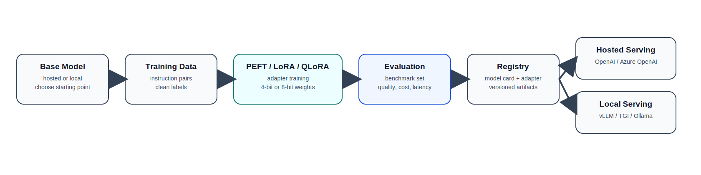

The fine-tuning pipeline is:

1. Choose base model.
2. Collect and clean training examples.
3. Split data into train, validation, and test sets.
4. Select adaptation method: prompt, LoRA, QLoRA, or full fine-tune.
5. Train the model.
6. Evaluate against a fixed benchmark set.
7. Register the model or adapter.
8. Deploy through hosted API or local serving stack.

## Tools

| Tool | Purpose |
|---|---|
| Hugging Face Transformers | Load and train models. |
| PEFT | Lightweight parameter-efficient adaptation. |
| bitsandbytes | Low-bit quantization and memory savings. |
| accelerate | Multi-device training support. |
| TRL | Training utilities for instruction and preference tuning. |
| MLflow | Track fine-tuning runs and metrics. |
| vLLM | Serve local models efficiently. |
| TGI | Text Generation Inference serving. |
| OpenAI/Azure OpenAI | Hosted model baseline or fallback. |

## Alternatives

| Need | Primary | Alternatives |
|---|---|---|
| Lightweight adaptation | LoRA/QLoRA | Adapters, prefix tuning |
| Full training | Transformers | PyTorch custom loop |
| Hosted models | OpenAI/Azure OpenAI | Claude, Gemini |
| Local serving | vLLM | TGI, Ollama |

## Implementation Guide

1. Define the exact task you want to improve.
2. Measure the prompting baseline first.
3. Decide whether the task needs fine-tuning or RAG.
4. Build a labeled dataset with clean input-output pairs.
5. Choose a base model that fits your GPU budget.
6. Prefer LoRA or QLoRA before full fine-tuning.
7. Use quantization when memory is limited.
8. Train on train split, tune on validation split, lock test split.
9. Compare against the baseline on a fixed benchmark.
10. Register the adapter or model version.
11. Deploy to local or hosted serving.

Decision guide:

| Situation | Recommendation |
|---|---|
| Need latest facts | Use RAG, not fine-tuning. |
| Need domain style or format consistency | Fine-tune with LoRA. |
| Need cheapest prototype | Use hosted model with prompting. |
| Need control over sensitive data | Use local model or private hosted deployment. |
| Need to run on limited GPU memory | Use QLoRA and quantization. |
| Need large behavior change and have lots of data | Consider full fine-tuning. |

## Best Practices

- Baseline prompting before training.
- Keep a fixed eval set.
- Use LoRA first.
- Track training, validation, and test metrics separately.
- Version the dataset and adapter.
- Compare cost and latency before deployment.
- Keep factual knowledge in RAG, not fine-tuning.

## Common Mistakes

- Fine-tuning to memorize facts that should live in documents.
- Training without a benchmark.
- Using full fine-tuning when LoRA is enough.
- Ignoring quantization memory limits.
- Not checking output schema quality.
- Mixing training and test examples.

## Interview Questions

1. When would you fine-tune instead of use RAG?
2. What is PEFT?
3. What is LoRA?
4. What is QLoRA?
5. When should you choose local models over hosted models?

## Learning Resources

Study:

- Hugging Face Transformers
- PEFT and LoRA
- QLoRA and quantization
- Instruction tuning
- model evaluation basics
- vLLM and TGI serving

## Deliverables

- Prompt baseline report
- Fine-tuning dataset
- Training notebook or pipeline
- LoRA or QLoRA adapter
- Benchmark report
- Deployment notes
- Model card and adapter card

---

# Part 18: RAG Systems

## Purpose

RAG, or Retrieval-Augmented Generation, lets an LLM answer using external knowledge from documents and databases.

## Business Importance

Company documents are private and not inside public LLM training data. RAG makes LLM answers grounded in approved sources.

## Real-World Examples

- BFSI regulatory Q&A
- Healthcare policy Q&A
- Retail product catalog Q&A
- Marketing campaign brief Q&A

## Concepts

### Document Parsing

Extract text from PDFs, DOCX files, and text files.

### Chunking

Split documents into smaller pieces.

### Embeddings

Convert chunks into vectors.

### Vector Databases

Store and search embeddings.

### pgvector

pgvector stores embeddings in PostgreSQL.

### Qdrant

Qdrant is a dedicated vector database.

### Hybrid Search

Hybrid search combines keyword search and vector search.

### Reranking

Reranking reorders retrieved chunks using a stronger relevance model.

### Citation Generation

Citation generation links answer claims to source chunks.

### Knowledge Graph RAG

Knowledge Graph RAG adds entity relationships for complex connected reasoning.

## Architecture

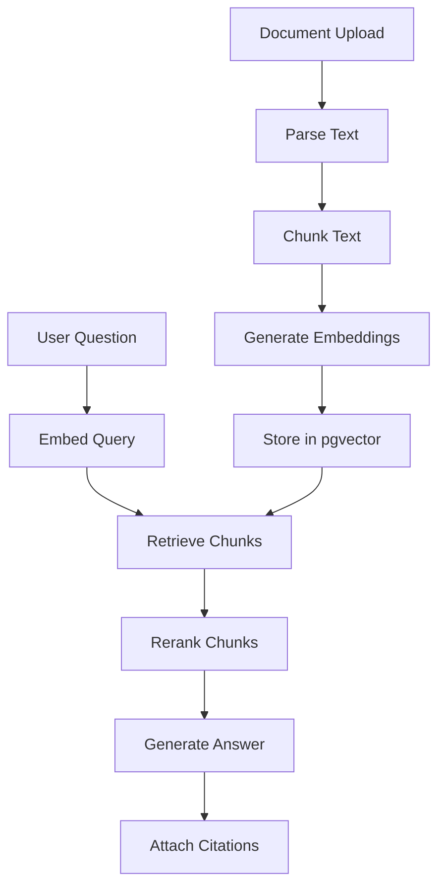
```mermaid
flowchart TD
    Document["Document Upload"]
    Parse["Parse Text"]
    Chunk["Chunk Text"]
    Embed["Generate Embeddings"]
    Store["Store in pgvector"]
    Query["User Question"]
    QueryEmbed["Embed Query"]
    Retrieve["Retrieve Chunks"]
    Rerank["Rerank Chunks"]
    Answer["Generate Answer"]
    Cite["Attach Citations"]

    Document --> Parse --> Chunk --> Embed --> Store
    Query --> QueryEmbed --> Retrieve
    Store --> Retrieve
    Retrieve --> Rerank
    Rerank --> Answer
    Answer --> Cite
```

## Tools

| Tool | Purpose |
|---|---|
| PyMuPDF | PDF parsing. |
| pdfplumber | PDF text and table extraction. |
| python-docx | Word parsing. |
| pgvector | Vector storage. |
| Qdrant | Optional vector database. |
| Ragas | RAG evaluation. |
| DeepEval | Evaluation. |
| Neo4j | Optional graph storage. |

## Alternatives

| Need | Primary | Alternatives |
|---|---|---|
| Vector DB | pgvector | Qdrant, Pinecone, Weaviate |
| Parsing | PyMuPDF | Unstructured, Apache Tika |
| Evaluation | Ragas | DeepEval, custom evals |
| Search | Hybrid | Pure vector, BM25 |

## Implementation Guide

1. Upload document.
2. Extract text.
3. Clean text.
4. Chunk text.
5. Generate embeddings.
6. Store chunks and vectors.
7. Embed query.
8. Retrieve top-k chunks.
9. Rerank chunks.
10. Generate answer.
11. Attach citations.
12. Evaluate answer.

## Best Practices

- Store metadata.
- Preserve chunk IDs.
- Enforce document permissions.
- Use hybrid search.
- Use metadata filters.
- Evaluate retrieval separately from generation.
- Refuse answer when evidence is insufficient.

## Common Mistakes

- Chunks too large or small.
- No citations.
- No metadata filtering.
- No retrieval evaluation.
- Too many chunks in prompt.
- Ignoring document permissions.

## Interview Questions

1. What is RAG?
2. Why use embeddings?
3. What is chunking?
4. What is hybrid search?
5. What is reranking?
6. How do you evaluate RAG?

## Learning Resources

Study:

- Vector search
- pgvector
- RAG pipelines
- Hybrid search
- Reranking
- Ragas

## Deliverables

- Document upload
- Parser pipeline
- Chunking pipeline
- Embedding pipeline
- pgvector storage
- Search API
- Citation-backed answer API
- RAG eval suite

---

# Part 19: Agentic AI

## Purpose

Agentic AI lets the copilot choose tools, plan steps, execute workflows, remember context, and recover from failures.

## Business Importance

A chatbot answers text. An agent can query SQL, search documents, call models, generate charts, request approval, and summarize findings.

## Real-World Examples

User asks:

> Why did revenue drop last week?

Agent steps:

1. Query revenue by day.
2. Compare to previous period.
3. Segment by product and region.
4. Retrieve campaign notes.
5. Generate explanation.
6. Show chart and citations.

## Concepts

### Agents

An agent is an AI system that decides what action to take next.

### Agent Memory

Short-term memory stores current conversation. Long-term memory stores durable context.

### Agent Planning

Planning breaks tasks into steps.

### Agent Workflows

Workflows define allowed steps and transitions.

### LangGraph

LangGraph builds stateful agent workflows as graphs.

### Multi-Agent Systems

Specialized agents handle different tasks:

- SQL agent
- RAG agent
- ML agent
- Chart agent
- Forecast agent
- Governance agent

### Tool Routing

Tool routing chooses the right tool or agent.

## Architecture

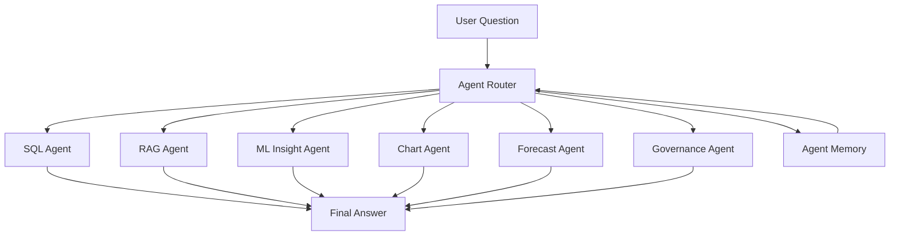
```mermaid
flowchart TD
    User["User Question"]
    Router["Agent Router"]
    SQL["SQL Agent"]
    RAG["RAG Agent"]
    ML["ML Insight Agent"]
    Chart["Chart Agent"]
    Forecast["Forecast Agent"]
    Gov["Governance Agent"]
    Memory["Agent Memory"]
    Final["Final Answer"]

    User --> Router
    Router --> SQL
    Router --> RAG
    Router --> ML
    Router --> Chart
    Router --> Forecast
    Router --> Gov

    SQL --> Final
    RAG --> Final
    ML --> Final
    Chart --> Final
    Forecast --> Final
    Gov --> Final

    Router --> Memory
    Memory --> Router
```

## Tools

| Tool | Purpose |
|---|---|
| LangGraph | Stateful agent workflows. |
| Redis | Short-term state. |
| PostgreSQL | Persistent traces. |
| pgvector | Long-term memory retrieval. |
| FastAPI | Agent API. |
| OpenTelemetry | Agent tracing. |

## Alternatives

| Need | Primary | Alternatives |
|---|---|---|
| Agent framework | LangGraph | Semantic Kernel, AutoGen |
| Memory | PostgreSQL/pgvector | Redis, Qdrant |
| Tracing | OpenTelemetry | LangSmith, custom logs |

## Implementation Guide

1. Create tool registry.
2. Create router.
3. Add SQL tool.
4. Add RAG tool.
5. Add chart tool.
6. Add ML prediction tool.
7. Add approval workflow.
8. Store traces.
9. Add memory.
10. Add eval tests.

## Best Practices

- Limit available tools.
- Validate tool arguments.
- Log every step.
- Add timeouts.
- Require approval for risky actions.
- Keep final answers evidence-backed.

## Common Mistakes

- Too many tools.
- No guardrails.
- No tracing.
- No approval workflow.
- Unsafe SQL.

## Interview Questions

1. What is an AI agent?
2. What is tool routing?
3. Why use LangGraph?
4. What is agent memory?
5. How do you trace agent workflows?

## Learning Resources

Study:

- Agent basics
- LangGraph
- Tool calling
- State machines
- Human-in-the-loop systems

## Deliverables

- Agent router
- SQL agent
- RAG agent
- ML agent
- Chart agent
- Memory store
- Agent traces
- Human approval queue

---

# Part 20: LLMOps

## Purpose

LLMOps manages LLM applications in production through prompt management, evaluation, monitoring, guardrails, feedback, and cost control.

## Business Importance

LLMs can hallucinate, leak sensitive data, call wrong tools, or become expensive. LLMOps makes them measurable and safer.

## Real-World Examples

- Prompt update worsens answer quality.
- RAG answer has wrong citation.
- Agent chooses wrong tool.
- LLM cost spikes.
- User flags unsafe response.

## Concepts

### LangSmith

LLM tracing and evaluation platform.

### DeepEval

Framework for testing LLM outputs.

### Ragas

Evaluation library for RAG systems.

### Promptfoo

Prompt regression testing tool.

### Prompt Versioning

Prompts are versioned like code.

### Evaluation Frameworks

Evaluation frameworks measure quality, correctness, citation accuracy, and safety.

### Guardrails

Guardrails block unsafe inputs, outputs, and tool calls.

### Feedback Loops

Users rate answers and feedback becomes eval data.

### Multi-Model Routing

Requests route across OpenAI, Azure OpenAI, Claude, Llama, Mistral, or local models based on quality, cost, latency, context length, and tenant policy.

## Architecture

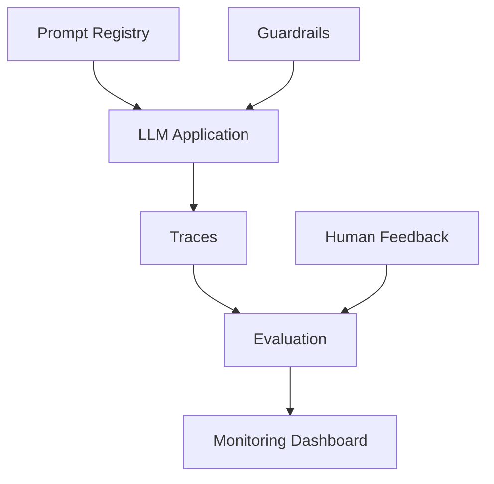
```mermaid
flowchart TD
    Prompt["Prompt Registry"]
    App["LLM Application"]
    Trace["Traces"]
    Eval["Evaluation"]
    Feedback["Human Feedback"]
    Guardrails["Guardrails"]
    Monitor["Monitoring Dashboard"]

    Prompt --> App
    Guardrails --> App
    App --> Trace
    Trace --> Eval
    Feedback --> Eval
    Eval --> Monitor
```

## Tools

| Tool | Purpose |
|---|---|
| LangSmith | Tracing and evaluation. |
| DeepEval | Output quality tests. |
| Ragas | RAG metrics. |
| Promptfoo | Prompt regression. |
| Guardrails AI | Safety checks. |
| OpenTelemetry | Observability. |
| Custom tables | Prompt registry and feedback. |

## Alternatives

- Arize Phoenix
- Helicone
- Weights & Biases Weave
- Custom pytest evals

## Implementation Guide

1. Create prompt registry.
2. Store prompt versions.
3. Log LLM calls.
4. Add RAG evals.
5. Add tool selection tests.
6. Add prompt regression tests.
7. Add feedback UI.
8. Add cost dashboard.
9. Add guardrails.
10. Add release checklist.

## Best Practices

- Evaluate prompts before deployment.
- Track model, prompt, and data versions.
- Store citations.
- Monitor hallucination rate.
- Track cost per tenant.
- Use small evals in CI.

## Common Mistakes

- Editing prompts without versioning.
- No evals.
- No cost tracking.
- No user feedback.
- No guardrails.
- Not testing tool calls.

## Interview Questions

1. What is LLMOps?
2. How do you evaluate RAG?
3. What is prompt regression testing?
4. How do you detect hallucination?
5. How do you track LLM cost?

## Learning Resources

Study:

- Ragas
- DeepEval
- Promptfoo
- LLM tracing
- Prompt versioning
- Guardrails

## Deliverables

- Prompt registry
- LLM call logs
- RAG eval pipeline
- Prompt regression tests
- Feedback UI
- Cost dashboard
- Guardrail checks

### Benchmarking and Evaluation

## Purpose

Benchmarking measures whether a change actually improved the system. It is the discipline of comparing a model, prompt, retriever, or agent against a fixed standard.

## Business Importance

Without benchmarks, teams ship changes based on intuition. That causes silent regressions in accuracy, latency, cost, and safety.

## Real-World Examples

- a new retrieval chunking strategy improves citation accuracy
- a new prompt reduces hallucinations but increases latency
- a new model improves answer quality but doubles token cost
- a new agent router improves task completion but chooses the wrong tools less often

## Concepts

### Benchmark Set

A benchmark set is a fixed collection of inputs, expected outputs, and scoring rules.

### Golden Dataset

A golden dataset contains examples that are reviewed and approved by humans.

### Offline Evaluation

Offline evaluation runs against stored data before release.

### Online Evaluation

Online evaluation measures live production behavior.

### Regression Testing

Regression testing checks that a new version does not perform worse than the old one on important cases.

### Human-in-the-Loop Review

Some outputs, especially for agents and LLMs, need human review because automated metrics are not enough.

## Architecture

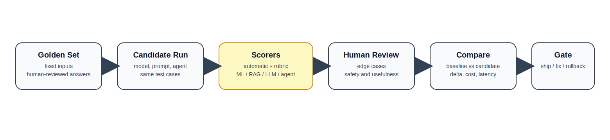

The benchmarking flow is:

1. Freeze the eval dataset.
2. Run the candidate system.
3. Score outputs with automatic metrics.
4. Review a subset manually.
5. Compare against the baseline.
6. Decide whether to ship, fix, or roll back.

## Metrics by System Type

| System | Primary Metrics | Secondary Metrics |
|---|---|---|
| ML classification | AUC, precision, recall, F1, calibration | latency, cost, fairness slices |
| ML regression | MAE, RMSE, MAPE, R2 | stability, calibration |
| Forecasting | MAE, RMSE, MAPE, sMAPE, backtest error | interval coverage |
| Recommendation | Precision@k, Recall@k, NDCG, MAP | diversity, novelty |
| RAG | recall@k, MRR, citation accuracy, faithfulness | answer relevance, latency, cost |
| LLM chat | exact match, rubric score, schema validity | hallucination rate, refusal accuracy |
| Agent workflows | task success, tool accuracy, step count | recovery rate, latency, cost |

## Tools

| Tool | Purpose |
|---|---|
| MLflow | Track experiments and comparisons. |
| Evidently AI | Model and data monitoring. |
| Ragas | RAG evaluation. |
| DeepEval | LLM and RAG testing. |
| Promptfoo | Prompt regression testing. |
| pytest | Custom benchmark harness. |
| LangSmith | Traces and evals for LLM apps. |
| Great Expectations | Data benchmark prerequisites. |

## Alternatives

| Need | Primary | Alternatives |
|---|---|---|
| RAG evaluation | Ragas | DeepEval, custom judges |
| Prompt tests | Promptfoo | pytest-based golden tests |
| ML comparison | MLflow | W&B, custom dashboards |
| LLM evals | DeepEval | lm-eval-harness, human review |

## Implementation Guide

1. Define what "good" means for each subsystem.
2. Build a stable golden dataset.
3. Split benchmark sets by domain and use case.
4. Add an automated scorer for each metric.
5. Add a human review rubric for edge cases.
6. Run the baseline system and store its scores.
7. Run the candidate system against the same set.
8. Compare metric deltas and cost deltas.
9. Set release thresholds.
10. Fail the release if critical metrics regress.
11. Re-run benchmarks after prompt, model, retrieval, or workflow changes.

## Best Practices

- Keep benchmark datasets versioned.
- Include latency and cost, not only accuracy.
- Separate training data from benchmark data.
- Use the same benchmark for regression checks.
- Review a human sample for safety and usefulness.
- Track benchmarks by domain pack.

## Common Mistakes

- Changing the benchmark data every run.
- Measuring only one metric.
- Ignoring latency and cost.
- Using the training set as the benchmark set.
- Trusting automatic scoring without human review.

## Interview Questions

1. What is a benchmark set?
2. Why do you need golden data?
3. How do you benchmark a RAG system?
4. How do you benchmark an agent?
5. Why should cost be part of the benchmark?

## Learning Resources

Study:

- MLflow experiment tracking
- Ragas evaluation concepts
- Promptfoo basics
- DeepEval basics
- offline and online evaluation methods
- regression testing concepts

## Deliverables

- benchmark dataset
- scoring harness
- baseline score report
- candidate comparison report
- release threshold checklist
- human review rubric
- cost and latency analysis

---

# Part 21: AI Engineering

## Purpose

AI engineering builds reliable software systems around AI models, LLMs, tools, agents, APIs, background jobs, and user workflows.

## Business Importance

AI creates value only when integrated into secure, observable, testable, and reliable applications.

## Real-World Examples

- Chat endpoint streams answers.
- Tool calling executes safe SQL.
- Background job creates embeddings.
- RBAC blocks unauthorized dataset access.
- Logs trace an agent workflow.

## Concepts

### FastAPI

Python framework for APIs.

### REST APIs

HTTP endpoints that expose resources using GET, POST, PUT, DELETE.

### Authentication

Verifies identity.

### JWT

Signed token used for authentication.

### OAuth

Login through an external identity provider.

### RBAC

Permissions based on user roles.

### Background Jobs

Long-running tasks outside request/response.

### Redis

Cache, queue, session, short-term state.

### Celery

Background worker framework.

### API Design

Good APIs are predictable, versioned, validated, documented, and secure.

### Error Handling

Clear structured failures.

### Logging

Records what happened.

### API Gateway

Entry layer for routing, rate limiting, authentication, and versioning.

## Architecture

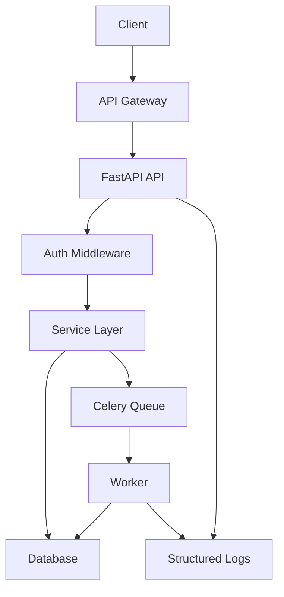
```mermaid
flowchart TD
    Client["Client"]
    Gateway["API Gateway"]
    API["FastAPI API"]
    Auth["Auth Middleware"]
    Service["Service Layer"]
    Queue["Celery Queue"]
    Worker["Worker"]
    DB["Database"]
    Logs["Structured Logs"]

    Client --> Gateway
    Gateway --> API
    API --> Auth
    Auth --> Service
    Service --> DB
    Service --> Queue
    Queue --> Worker
    Worker --> DB
    API --> Logs
    Worker --> Logs
```

## Tools

| Tool | Purpose |
|---|---|
| FastAPI | APIs. |
| Pydantic | Validation. |
| JWT | Auth tokens. |
| OAuth | Enterprise login. |
| Redis | Queue and cache. |
| Celery | Background jobs. |
| logging/structlog | Structured logs. |

## Alternatives

| Need | Primary | Alternatives |
|---|---|---|
| API | FastAPI | Django, Flask |
| Queue | Celery | RQ, Dramatiq |
| Cache | Redis | Memcached |
| Auth | JWT | Sessions, OAuth-only |

## Implementation Guide

Core APIs:

```text
/api/v1/auth
/api/v1/organizations
/api/v1/datasets
/api/v1/analytics
/api/v1/ml
/api/v1/rag
/api/v1/copilot
/api/v1/evals
/api/v1/admin
```

Standard response:

```json
{
  "data": {},
  "error": null,
  "request_id": "..."
}
```

## Best Practices

- Version APIs.
- Validate inputs.
- Use standard errors.
- Add request IDs.
- Use background jobs for long tasks.
- Make jobs retry-safe.
- Enforce RBAC in backend.

## Common Mistakes

- Long-running HTTP requests.
- Inconsistent errors.
- No API versioning.
- No auth checks.
- No logs.
- No retries.

## Interview Questions

1. What is REST?
2. What is JWT?
3. What is RBAC?
4. Why use background jobs?
5. How do you design APIs?

## Learning Resources

Study:

- FastAPI
- REST API design
- JWT
- OAuth basics
- Redis
- Celery
- Logging

## Deliverables

- Versioned APIs
- Auth middleware
- RBAC system
- Background jobs
- Error format
- Structured logging
- OpenAPI docs

---

# Part 22: Security

## Purpose

Security protects users, data, models, documents, APIs, and AI workflows.

## Business Importance

Enterprise systems handle sensitive data. Security failures can cause data leaks, compliance violations, financial loss, unsafe AI behavior, and loss of trust.

## Real-World Examples

- Healthcare data must protect PII.
- BFSI systems require auditability.
- Marketing systems must respect consent.
- RAG must not return unauthorized documents.
- Agents must not run dangerous actions.

## Concepts

| Concept | Explanation |
|---|---|
| Authentication | Who are you? |
| Authorization | What can you access? |
| Encryption | Protect data using cryptography. |
| Secrets | Passwords, keys, and tokens. |
| Audit logs | Record sensitive actions. |
| PII | Personally identifiable information. |
| RLS | Database-level row filtering. |
| Prompt injection | Malicious prompt trying to override rules. |

## Architecture

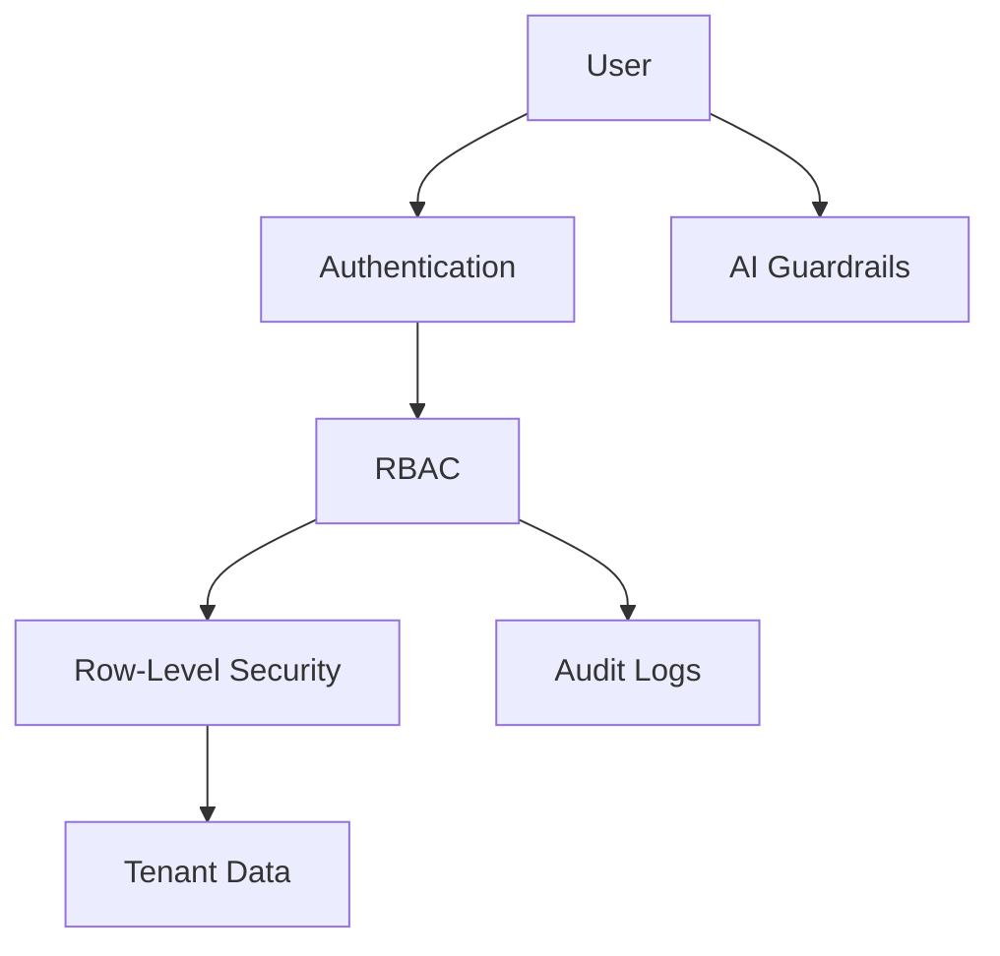
```mermaid
flowchart TD
    User["User"]
    Auth["Authentication"]
    RBAC["RBAC"]
    RLS["Row-Level Security"]
    Data["Tenant Data"]
    Audit["Audit Logs"]
    Guard["AI Guardrails"]

    User --> Auth
    Auth --> RBAC
    RBAC --> RLS
    RLS --> Data
    RBAC --> Audit
    User --> Guard
```

## Expanded Security Topics

### Security Principles

Every security control in the platform should support one or more of the following principles:

- Confidentiality: only authorized users can see data.
- Integrity: data and model artifacts cannot be changed silently.
- Availability: systems remain accessible when needed.
- Least privilege: users only get the minimum access required.
- Defense in depth: one control is never the only barrier.

### Data Protection

Sensitive data must be protected in transit, at rest, and in logs.

Controls:

- TLS for all HTTP traffic
- Encryption at rest in the database and storage layer
- Secrets manager for keys and tokens
- PII masking before logging or model input
- Optional field-level encryption for highly sensitive values

### Tenant Isolation

The platform is multi-tenant, so one organization's data must never leak into another organization's view.

Controls:

- Organization ID on all records
- Row-Level Security in PostgreSQL
- Tenant-aware APIs
- Tenant-aware background jobs
- Tenant-aware RAG retrieval filters

### Compliance

The system should support common enterprise compliance expectations:

- GDPR concepts such as access, deletion, and minimization
- Audit trails for sensitive operations
- Data retention policies
- Consent tracking when applicable
- Model and dataset cards

### AI Security

LLM and agent systems introduce their own threats.

Threats:

- Prompt injection
- Jailbreak attempts
- Tool misuse
- Unsafe SQL generation
- Retrieval of unauthorized documents
- Sensitive data leakage in responses

Mitigations:

- Prompt guardrails
- Tool argument validation
- Safe SQL validator
- Permission-aware retrieval
- Output filtering
- Human approval for high-risk actions

## Tools

| Tool | Purpose |
|---|---|
| JWT | Authentication. |
| OAuth | Enterprise identity. |
| PostgreSQL RLS | Tenant isolation. |
| Azure Key Vault | Secrets. |
| TLS | Encryption in transit. |
| Audit tables | Compliance. |
| Guardrails | AI safety. |
| Open Policy Agent | Policy enforcement. |
| HashiCorp Vault | Alternative secrets manager. |
| Azure Monitor | Security event visibility. |

## Alternatives

- AWS Secrets Manager
- Auth0
- Azure Entra ID
- HashiCorp Vault
- Open Policy Agent

## Implementation Guide

1. Add JWT auth.
2. Add organization model.
3. Add RBAC.
4. Add dataset permissions.
5. Add PostgreSQL RLS.
6. Add audit logs.
7. Add PII masking.
8. Add secrets manager.
9. Add guardrails.
10. Add security tests.
11. Add audit export for compliance review.
12. Add document-level permission checks in RAG.
13. Add agent approval gates for sensitive operations.
14. Add security incident logging and alerting.

## Best Practices

- Deny by default.
- Enforce tenant isolation.
- Never log secrets.
- Encrypt in transit.
- Use secrets manager.
- Audit sensitive actions.
- Validate LLM tool calls.
- Test permissions.
- Rotate secrets regularly.
- Use distinct credentials per environment.
- Review access periodically.
- Redact PII in traces and logs.
- Add security checks to CI.

## Common Mistakes

- Only hiding UI buttons.
- No backend permission checks.
- Missing tenant filters.
- Logging API keys.
- No audit logs.
- Sending PII to LLM unnecessarily.
- Forgetting to secure embeddings and vector search.
- Treating prompt injection as a low-risk problem.
- Storing secrets in source control.

## Interview Questions

1. Authentication vs authorization?
2. What is RBAC?
3. What is row-level security?
4. How do you protect secrets?
5. What is prompt injection?
6. How do you handle GDPR-style deletion requests?
7. Why do RAG and agents need separate security controls?

## Learning Resources

Study:

- OWASP basics
- JWT and OAuth
- PostgreSQL RLS
- Secrets management
- Prompt injection
- Data privacy
- Cloud IAM basics
- Secure coding practices
- LLM security patterns

## Deliverables

- Auth system
- RBAC
- RLS policies
- Dataset permissions
- Audit logs
- PII masking
- Guardrail tests
- Security checklist
- Data encryption plan
- Secrets manager integration
- Compliance workflow
- Threat model document

---

# Part 23: DevOps

## Purpose

DevOps automates building, testing, packaging, and deploying software.

## Business Importance

DevOps helps teams release faster and safer.

## Real-World Examples

- Pull requests run tests.
- Docker Compose starts local services.
- GitHub Actions builds images.
- Kubernetes runs containers.
- Terraform creates cloud infrastructure.

## Concepts

### Docker

Packages an application and dependencies into a container.

### Docker Compose

Runs multiple containers locally.

### Git

Tracks code changes.

### GitHub Actions

Runs CI/CD workflows.

### CI/CD

Continuous Integration and Continuous Delivery/Deployment.

### Kubernetes

Runs and manages containers at scale.

### Helm

Packages Kubernetes resources.

### Terraform

Creates infrastructure using code.

## Architecture

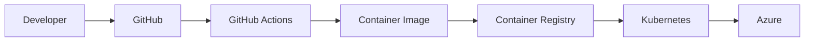
```mermaid
flowchart LR
    Dev["Developer"]
    Git["GitHub"]
    CI["GitHub Actions"]
    Image["Container Image"]
    Registry["Container Registry"]
    K8s["Kubernetes"]
    Cloud["Azure"]

    Dev --> Git
    Git --> CI
    CI --> Image
    Image --> Registry
    Registry --> K8s
    K8s --> Cloud
```

## Tools

| Tool | Purpose |
|---|---|
| Docker | Containerization. |
| Docker Compose | Local multi-service environment. |
| Git | Version control. |
| GitHub Actions | CI/CD. |
| Kubernetes | Container orchestration. |
| Helm | Kubernetes packaging. |
| Terraform | Infrastructure as code. |

## Alternatives

| Tool | Alternatives |
|---|---|
| Docker | Podman |
| GitHub Actions | Azure DevOps, GitLab CI |
| Kubernetes | ECS, Azure Container Apps |
| Helm | Kustomize |
| Terraform | Pulumi, Bicep |

## Implementation Guide

1. Create backend Dockerfile.
2. Create frontend Dockerfile.
3. Create docker-compose.yml.
4. Add PostgreSQL and Redis.
5. Add GitHub Actions for lint/test.
6. Build and push images.
7. Create Kubernetes manifests.
8. Package with Helm.
9. Provision cloud with Terraform.

## Best Practices

- Keep images small.
- Use env vars.
- Never commit secrets.
- Run tests in CI.
- Add health checks.
- Support rollback.

## Common Mistakes

- Manual deployments.
- Committing `.env`.
- No CI tests.
- Huge images.
- No health checks.

## Interview Questions

1. What is Docker?
2. What is Docker Compose?
3. What is CI/CD?
4. What is Kubernetes?
5. What is Terraform?

## Learning Resources

Study:

- Docker
- Git
- GitHub Actions
- Kubernetes
- Helm
- Terraform

## Deliverables

- Dockerfiles
- docker-compose.yml
- CI workflow
- Kubernetes manifests
- Helm chart
- Terraform configs
- Deployment runbook

---

# Part 24: Cloud Architecture

## Purpose

Cloud architecture explains how the platform runs on Azure.

## Business Importance

Cloud provides scalable compute, managed databases, storage, networking, security, monitoring, and AI services.

## Real-World Examples

- Backend runs on Azure App Service.
- Images stored in Azure Container Registry.
- PostgreSQL runs on Azure Database for PostgreSQL.
- Files stored in Azure Blob Storage.
- LLM calls use Azure OpenAI.
- Secrets stored in Azure Key Vault.
- Logs sent to Azure Monitor.

## Concepts

### Azure App Service

Runs web applications without managing servers.

### Azure Container Registry

Stores Docker images.

### Azure PostgreSQL

Managed PostgreSQL database.

### Azure OpenAI

Managed access to OpenAI models through Azure.

### Azure Monitor

Collects logs, metrics, and alerts.

### Azure Key Vault

Stores secrets and keys.

## Architecture

```mermaid
flowchart TD
    User["User"]
    DNS["DNS and HTTPS"]
    Frontend["Static Web App or App Service Frontend"]
    Backend["Azure App Service Backend"]
    ACR["Azure Container Registry"]
    PG["Azure PostgreSQL"]
    Storage["Azure Blob Storage"]
    OpenAI["Azure OpenAI"]
    KeyVault["Azure Key Vault"]
    Monitor["Azure Monitor"]

    User --> DNS
    DNS --> Frontend
    Frontend --> Backend
    ACR --> Backend
    Backend --> PG
    Backend --> Storage
    Backend --> OpenAI
    Backend --> KeyVault
    Backend --> Monitor
```

## Tools

| Azure Service | Purpose |
|---|---|
| App Service | Run backend/frontend. |
| Container Registry | Store images. |
| PostgreSQL | Managed database. |
| Blob Storage | Store files. |
| Azure OpenAI | LLM provider. |
| Key Vault | Secrets. |
| Azure Monitor | Logs and metrics. |

## Alternatives

| Azure | AWS Equivalent | GCP Equivalent |
|---|---|---|
| App Service | App Runner | Cloud Run |
| ACR | ECR | Artifact Registry |
| Azure PostgreSQL | RDS PostgreSQL | Cloud SQL |
| Blob Storage | S3 | Cloud Storage |
| Azure OpenAI | Bedrock/OpenAI direct | Vertex AI |

## Implementation Guide

1. Create resource group.
2. Create PostgreSQL.
3. Create Blob Storage.
4. Create Key Vault.
5. Create Container Registry.
6. Build and push images.
7. Deploy backend.
8. Deploy frontend.
9. Configure environment variables.
10. Configure Monitor.
11. Add alerts.

## Best Practices

- Use managed services first.
- Use Key Vault.
- Enable TLS.
- Restrict database access.
- Use staging slots.
- Monitor cost.
- Use Terraform.

## Common Mistakes

- Hardcoded secrets.
- Public database.
- No monitoring.
- No backups.
- No cost alerts.

## Interview Questions

1. Why use Azure App Service?
2. What is Azure Container Registry?
3. How do you store secrets?
4. How do you deploy FastAPI to Azure?

## Learning Resources

Study:

- Azure App Service
- Azure PostgreSQL
- Azure Blob Storage
- Azure Key Vault
- Azure Monitor
- Terraform Azure provider

## Deliverables

- Azure architecture diagram
- Terraform config
- App Service deployment
- PostgreSQL setup
- Blob Storage setup
- Key Vault setup
- Monitor dashboard

---

# Part 25: Observability

## Purpose

Observability helps engineers understand what the system is doing using logs, metrics, traces, dashboards, and alerts.

## Business Importance

Without observability, teams cannot debug slow APIs, failed jobs, model drift, high LLM cost, or incorrect agent behavior.

## Real-World Examples

- API latency dashboard
- LLM cost dashboard
- Drift dashboard
- Error alerts
- Agent trace viewer
- Token usage by tenant

## Concepts

### OpenTelemetry

Collects traces, metrics, and logs.

### Prometheus

Stores time-series metrics.

### Grafana

Visualizes metrics.

### Monitoring

Tracks system health.

### Alerting

Notifies people when something is wrong.

### Cost Tracking

Measures LLM and infrastructure spend.

### LLM Monitoring

Tracks prompts, outputs, tokens, cost, latency, and quality.

### Model Monitoring

Tracks drift, prediction distribution, and performance.

## Architecture

```mermaid
flowchart TD
    App["Application"]
    Logs["Logs"]
    Metrics["Metrics"]
    Traces["Traces"]
    Prometheus["Prometheus"]
    Grafana["Grafana"]
    Alerts["Alerts"]

    App --> Logs
    App --> Metrics
    App --> Traces
    Metrics --> Prometheus
    Prometheus --> Grafana
    Grafana --> Alerts
```

## Tools

| Tool | Purpose |
|---|---|
| OpenTelemetry | Traces and instrumentation. |
| Prometheus | Metrics. |
| Grafana | Dashboards. |
| Azure Monitor | Cloud monitoring. |
| Evidently AI | ML drift. |
| Custom tables | LLM cost tracking. |

## Alternatives

- Datadog
- New Relic
- Grafana Cloud
- Arize Phoenix
- Helicone
- Weights & Biases Weave

## Implementation Guide

1. Add request IDs.
2. Add structured JSON logs.
3. Add OpenTelemetry tracing.
4. Add Prometheus metrics endpoint.
5. Add Grafana dashboards.
6. Add LLM call logging.
7. Add cost tracking.
8. Add drift dashboard.
9. Add alerts.

## Best Practices

- Log with correlation IDs.
- Do not log secrets.
- Track p95 latency.
- Track errors by endpoint.
- Track LLM tokens and cost.
- Track agent steps.
- Monitor system and model behavior.

## Common Mistakes

- Print-only logging.
- No request ID.
- Too many noisy alerts.
- No cost monitoring.
- No agent tracing.

## Interview Questions

1. What is observability?
2. What are logs, metrics, and traces?
3. What is OpenTelemetry?
4. Why use Prometheus?
5. How do you monitor LLM cost?

## Learning Resources

Study:

- OpenTelemetry
- Prometheus
- Grafana
- Structured logging
- SRE basics
- ML monitoring

## Deliverables

- JSON logging
- Trace IDs
- Prometheus metrics
- Grafana dashboards
- Alert rules
- LLM cost dashboard
- Model drift dashboard

---

# Part 26: Testing

## Purpose

Testing verifies that the system works correctly and continues working after changes.

## Business Importance

Testing prevents regressions, incorrect metrics, security failures, model bugs, and unreliable LLM behavior.

## Real-World Examples

- API tests ensure login works.
- Data tests ensure required columns exist.
- ML tests ensure pipelines run.
- RAG tests verify citations.
- Agent tests verify tool selection.
- Security tests verify tenant isolation.

## Concepts

| Test Type | Purpose |
|---|---|
| Unit test | Test one function. |
| Integration test | Test multiple components. |
| API test | Test endpoints. |
| Data test | Test data quality. |
| ML test | Test model pipeline. |
| LLM eval | Test LLM behavior. |
| Security test | Test permissions. |
| Load test | Test performance. |

## Architecture

```mermaid
flowchart TD
    Unit["Unit Tests"]
    Integration["Integration Tests"]
    API["API Tests"]
    Data["Data Tests"]
    ML["ML Tests"]
    LLM["LLM Evals"]
    E2E["End-to-End Tests"]

    Unit --> Integration
    Integration --> API
    API --> Data
    Data --> ML
    ML --> LLM
    LLM --> E2E
```

## Expanded Testing Topics

### Test Pyramid

The test pyramid is a simple way to think about coverage:

- Many unit tests
- Fewer integration tests
- Even fewer end-to-end tests
- Targeted load tests and security tests

### Test Data Strategy

Tests need stable datasets.

Use:

- Small synthetic fixtures for unit tests
- Seeded database records for integration tests
- Golden datasets for analytics and ML checks
- Adversarial cases for RAG and agent tests

### API and Contract Testing

APIs should be tested for:

- Required fields
- Response schema
- Error behavior
- Authorization failures
- Backward compatibility

### Data and Analytics Testing

Analytics models should be tested for:

- Null handling
- Uniqueness
- Accepted ranges
- Correct aggregation logic
- Metric consistency

### ML and LLM Testing

ML systems should be tested for:

- Feature availability
- Training pipeline success
- Evaluation thresholds
- Model serialization
- Prediction schema

LLM systems should be tested for:

- Prompt regression
- Citation accuracy
- Hallucination resistance
- Tool selection accuracy
- Unsafe content detection

### Security and Load Testing

Security tests should cover:

- Auth failures
- RBAC boundaries
- Tenant isolation
- RLS enforcement
- Safe SQL blocking

Load tests should cover:

- Dashboard query bursts
- Batch upload spikes
- LLM concurrency
- Agent workflow latency
- Worker queue backlog

## Tools

| Tool | Purpose |
|---|---|
| pytest | Python tests. |
| HTTPX | API testing. |
| dbt tests | Analytics tests. |
| Great Expectations | Data tests. |
| Ragas/DeepEval | LLM evals. |
| Playwright | Frontend E2E. |
| Locust/k6 | Load testing. |
| factory_boy | Test fixture generation. |
| pytest-asyncio | Async test support. |
| testcontainers | Real dependency integration tests. |

## Alternatives

- unittest
- Cypress
- JMeter
- Custom evals
- Postman/Newman for API smoke tests

## Implementation Guide

1. Unit tests for services.
2. Repository tests with test database.
3. API tests.
4. Data validation tests.
5. dbt tests.
6. ML pipeline tests.
7. RAG eval tests.
8. Agent routing tests.
9. Security tests.
10. End-to-end tests.
11. Load tests for upload, query, and inference paths.
12. Regression tests for prompt and metric changes.

## Best Practices

- Tests should be deterministic.
- Use fixtures.
- Test errors.
- Run tests in CI.
- Version eval sets.
- Test tenant isolation.
- Test safe SQL blocking.
- Separate fast unit tests from slower integration tests.
- Keep reusable synthetic datasets under version control.
- Add explicit pass/fail thresholds for ML and LLM evals.
- Fail the pipeline when a critical eval regresses.

## Common Mistakes

- Only testing happy paths.
- Tests depend on external APIs.
- No test database.
- No LLM evals.
- No security tests.
- No fixture strategy.
- Flaky tests in CI.
- Skipping load tests until late.

## Interview Questions

1. What is unit testing?
2. What is integration testing?
3. How do you test APIs?
4. How do you evaluate RAG?
5. How do you test security?
6. What is the test pyramid?
7. How do you test ML pipelines?

## Learning Resources

Study:

- pytest
- FastAPI testing
- dbt tests
- Playwright
- RAG evaluation
- Load testing
- Contract testing
- Synthetic test data design
- CI test orchestration

## Deliverables

- pytest suite
- API tests
- Data tests
- dbt tests
- ML tests
- LLM evals
- E2E tests
- CI workflow
- Load test plan
- Regression test suite
- Test fixture library

---

# Part 27: Deployment

## Purpose

Deployment moves the application from local development to an environment where users can access it.

## Business Importance

Software creates business value only when deployed reliably.

## Real-World Examples

- Local Docker Compose for development.
- Staging environment for testing.
- Production deployment through CI/CD.
- Blue-green deployment.
- Canary release.

## Concepts

| Strategy | Meaning |
|---|---|
| Recreate | Stop old version and start new. |
| Rolling | Gradually replace instances. |
| Blue-green | Two environments, switch traffic. |
| Canary | Send small traffic to new version. |
| Rollback | Return to previous version. |

## Architecture

```mermaid
flowchart LR
    Code["Code"]
    CI["CI Pipeline"]
    Image["Docker Image"]
    Registry["Container Registry"]
    Staging["Staging"]
    Prod["Production"]
    Monitor["Monitoring"]

    Code --> CI
    CI --> Image
    Image --> Registry
    Registry --> Staging
    Staging --> Prod
    Prod --> Monitor
```

## Tools

| Tool | Purpose |
|---|---|
| Docker | Package app. |
| GitHub Actions | Build, test, deploy. |
| Azure Container Registry | Store images. |
| Azure App Service | Deploy app. |
| Kubernetes | Advanced deployment. |
| Helm | Package Kubernetes. |
| Terraform | Provision infrastructure. |

## Alternatives

- Azure Container Apps
- AKS
- AWS ECS/EKS
- GCP Cloud Run/GKE

## Implementation Guide

1. Local Docker Compose.
2. Staging environment.
3. Production environment.
4. CI/CD pipeline.
5. Secrets manager.
6. Monitoring.
7. Rollback process.
8. Canary deployment.
9. Blue-green deployment.

## Best Practices

- Separate dev/staging/prod.
- Use environment variables.
- Use secrets manager.
- Run migrations safely.
- Add health checks.
- Monitor after deployment.
- Keep rollback ready.

## Common Mistakes

- Manual deployment from laptop.
- No staging.
- No rollback.
- No health checks.
- Secrets in code.
- No monitoring.

## Interview Questions

1. What is CI/CD?
2. What is blue-green deployment?
3. What is canary deployment?
4. How do you rollback?
5. How do you manage secrets?

## Learning Resources

Study:

- Docker deployment
- Azure App Service
- GitHub Actions
- Kubernetes deployments
- Helm
- Terraform

## Deliverables

- Local deployment
- Staging deployment
- Production plan
- CI/CD pipeline
- Rollback runbook
- Deployment checklist

---

# Part 28: Project Roadmap

## Purpose

The roadmap breaks the platform into manageable implementation phases.

## Business Importance

A roadmap prevents scope overload and helps the team deliver value incrementally.

## Roadmap Table

| Phase | Objectives | Deliverables | Skills Learned | Technologies | Effort | Dependencies | Success Criteria |
|---|---|---|---|---|---|---|---|
| 1 Foundation | Repo, backend, frontend, DB | App skeleton | Python, React, SQL | FastAPI, React, PostgreSQL | 2-3 weeks | None | App runs locally |
| 2 Auth | Users, roles, tenants | Login, RBAC | Auth, security | JWT, SQLAlchemy | 1-2 weeks | Phase 1 | Protected APIs |
| 3 Data Upload | Upload and validate CSV | Dataset pipeline | Data engineering | Pandas, Polars, DuckDB | 2-3 weeks | Phase 2 | Quality report works |
| 4 Analytics | KPIs and dashboards | Metrics UI | SQL, BI | dbt, Recharts | 2-3 weeks | Phase 3 | Domain dashboard works |
| 5 Data Science | RFM, A/B, causal, recs | DS modules | Statistics, DS | scipy, sklearn | 4-6 weeks | Phase 4 | Reports generated |
| 6 ML | Train and evaluate models | ML pipeline | ML | XGBoost, SHAP | 4-6 weeks | Phase 5 | Metrics logged |
| 7 MLOps | Registry and serving | Model lifecycle | MLOps | MLflow, Evidently | 4-6 weeks | Phase 6 | Model monitored |
| 8 RAG | Document Q&A | Cited answers | GenAI | pgvector, embeddings | 3-5 weeks | Phase 3 | Cited answers work |
| 9 Agents | Tool routing | Agent workflows | AI agents | LangGraph | 4-6 weeks | Phase 8 | Agent uses tools |
| 10 LLMOps | Evals and guardrails | Eval suite | LLMOps | Ragas, DeepEval | 3-5 weeks | Phase 9 | Eval dashboard works |
| 11 Observability | Logs, metrics, traces | Dashboards | SRE | OTel, Grafana | 2-4 weeks | Core APIs | Alerts work |
| 12 Cloud | Azure deployment | Cloud app | DevOps | Docker, Azure | 3-5 weeks | Stable app | Staging deploy works |
| 13 Advanced Infra | K8s, Helm, Terraform | Prod-style infra | Platform eng | K8s, Helm, Terraform | 5-8 weeks | Phase 12 | IaC deployment works |
| 14 Portfolio | Demo and docs | Interview package | Communication | Markdown, diagrams | 1-2 weeks | All phases | Demo ready |

## Deliverables

- Project backlog
- Phase acceptance criteria
- Demo checkpoints
- Learning checkpoints
- Mentor review checklist

---

# Part 29: Interview Preparation

## Purpose

This section helps learners explain the project in interviews.

## Elevator Pitch

> I built an enterprise multi-domain AI Decision Intelligence Copilot for Healthcare, BFSI, Retail, and Marketing. The platform lets users upload datasets and documents, validate data, generate dashboards, train ML models, run forecasts, ask citation-backed questions, use LangGraph agents, monitor ML and LLM quality, and deploy the system with Docker, Kubernetes, Terraform, and Azure.

## Architecture Story

Explain the system in layers:

1. Frontend: React UI.
2. Backend: FastAPI APIs.
3. Database: PostgreSQL and pgvector.
4. Data platform: ingestion, validation, dbt.
5. Analytics: KPIs and dashboards.
6. ML: training, serving, monitoring.
7. GenAI: RAG and LLM provider abstraction.
8. Agents: LangGraph workflows.
9. Governance: RBAC, RLS, audit logs.
10. Operations: observability and deployment.

## Resume Bullets

- Built a multi-domain AI decision intelligence platform using FastAPI, PostgreSQL, pgvector, React, MLflow, and LangGraph.
- Designed data ingestion and validation pipelines using Pandas, Polars, DuckDB, Pandera, and dbt.
- Implemented ML workflows for churn prediction, fraud detection, credit scoring, forecasting, recommendations, and segmentation.
- Built RAG pipelines with document parsing, chunking, embeddings, hybrid search, reranking, and citation-backed answers.
- Developed LLMOps workflows including prompt versioning, RAG evaluation, citation accuracy checks, guardrails, and human feedback.
- Implemented MLOps capabilities including model registry, drift monitoring, batch inference, real-time inference, retraining, and rollback.
- Designed enterprise security with JWT, RBAC, tenant isolation, PostgreSQL RLS, PII masking, and audit logs.
- Deployed the platform using Docker, GitHub Actions, Kubernetes, Helm, Terraform, and Azure services.

## Interview Question Bank

Business:

1. What problem does the platform solve?
2. Who are the users?
3. What business value does it create?

Data:

1. How does ingestion work?
2. How do you validate data?
3. How do you model analytics tables?

ML:

1. How do you define target variables?
2. How do you avoid leakage?
3. How do you monitor drift?

GenAI:

1. How does RAG work?
2. How do you generate citations?
3. How do you evaluate LLM responses?

Agents:

1. How does the router choose tools?
2. How do you handle agent failures?
3. How do you trace agent steps?

Security:

1. How does tenant isolation work?
2. What is RLS?
3. How do you protect PII?

DevOps:

1. How do you deploy the system?
2. How does CI/CD work?
3. How do you rollback?

## Case Study Template

```md
# Case Study: Retail Churn Prediction

## Business Problem
Customers stop purchasing without warning.

## Data
Customers, orders, campaigns, web events.

## Approach
Create features from the past 90 days and predict churn in the next 60 days.

## Model
XGBoost classifier.

## Evaluation
AUC, precision, recall, lift.

## Output
Risk score, top drivers, retention list.

## Business Value
Better targeting of retention campaigns.

## Limitations
Prediction depends on data quality and historical patterns.
```

## Deliverables

- Interview pitch
- Resume bullets
- Four domain case studies
- Architecture explanation
- Demo script
- Benchmark reports

---

# Part 30: Developer Learning Roadmap

## Purpose

This roadmap helps a beginner grow into a Data Scientist, ML Engineer, AI Engineer, or GenAI Engineer while building the platform.

## Learning Map

```mermaid
flowchart TD
    Python["Python Basics"]
    Backend["FastAPI Backend"]
    SQL["SQL and PostgreSQL"]
    Data["Data Engineering"]
    Analytics["Analytics and BI"]
    DS["Data Science"]
    ML["Machine Learning"]
    MLE["ML Engineering"]
    GenAI["Generative AI"]
    RAG["RAG"]
    Agents["Agentic AI"]
    MLOps["MLOps and LLMOps"]
    DevOps["DevOps and Cloud"]
    Portfolio["Portfolio and Interview"]

    Python --> Backend
    Backend --> SQL
    SQL --> Data
    Data --> Analytics
    Analytics --> DS
    DS --> ML
    ML --> MLE
    MLE --> GenAI
    GenAI --> RAG
    RAG --> Agents
    Agents --> MLOps
    MLOps --> DevOps
    DevOps --> Portfolio
```

## Learning Plan

| Stage | What to Learn | Build |
|---|---|---|
| 1 | Python, OOP, type hints | Utility modules |
| 2 | FastAPI, Pydantic | Backend APIs |
| 3 | SQL, PostgreSQL | Database models |
| 4 | Pandas, Polars, DuckDB | Upload and profiling |
| 5 | dbt and analytics | KPI dashboards |
| 6 | Statistics and DS | RFM, A/B testing |
| 7 | ML | Churn and fraud models |
| 8 | ML Engineering | Serving and monitoring |
| 9 | GenAI | LLM provider and prompts |
| 10 | RAG | Document Q&A |
| 11 | Agents | LangGraph workflows |
| 12 | LLMOps | Evals and guardrails |
| 13 | DevOps | Docker and CI/CD |
| 14 | Cloud | Azure deployment |
| 15 | Portfolio | Demo and interview prep |

## Weekly Execution Checklist

Each week:

- Read one concept.
- Build one feature.
- Write tests.
- Update documentation.
- Add or update one diagram.
- Record what you learned.
- Create one interview explanation.
- Push clean commits.

## Deliverables

- Personal learning log
- Feature demos
- Tests
- Diagrams
- Interview notes
- Final portfolio README

---

# Appendix A: Suggested Repository Structure

```text
enterprise-ai-copilot/
  backend/
    app/
      api/
      core/
      auth/
      gateway/
      tenants/
      datasets/
      domain_packs/
      validation/
      analytics/
      data_science/
      experiments/
      recommendations/
      feature_store/
      ml/
      forecasting/
      rag/
      llm/
      guardrails/
      agents/
      evals/
      feedback/
      observability/
      security/
      workflows/
      events/
      db/
      tests/
    scripts/
    alembic/
    pyproject.toml

  frontend/
    src/
      app/
      components/
      features/
      pages/
      services/
      types/

  dbt/
    models/
      staging/
      marts/

  infra/
    docker/
    k8s/
    helm/
    terraform/

  data/
    sample_datasets/
    sample_documents/

  docs/
    adr/
    architecture.md
    business-requirements.md
    functional-requirements.md
    api.md
    domain-packs.md
    data-engineering.md
    data-science.md
    mlops.md
    llmops.md
    security.md
    deployment.md
    demo-script.md
    benchmark-reports.md

  docker-compose.yml
  README.md
```

---

# Appendix B: First MVP Scope

Build this first:

1. FastAPI backend.
2. React frontend.
3. PostgreSQL.
4. JWT authentication.
5. Organization model.
6. Dataset upload.
7. Data validation report.
8. Retail domain pack.
9. Basic KPI dashboard.
10. Churn model.
11. MLflow tracking.
12. Document upload.
13. Basic RAG with citations.
14. Copilot chat UI.
15. Docker Compose.

Do not start Kubernetes, LoRA, Temporal, or multi-agent workflows until the MVP works.

---

# Appendix C: First 30 Implementation Tickets

1. Create repository structure.
2. Add backend FastAPI app.
3. Add frontend React app.
4. Add PostgreSQL Docker Compose service.
5. Add Redis Docker Compose service.
6. Add SQLAlchemy setup.
7. Add Alembic setup.
8. Add user table.
9. Add organization table.
10. Add role and permission tables.
11. Add JWT auth.
12. Add protected route dependency.
13. Add dataset metadata table.
14. Add dataset upload endpoint.
15. Add file storage service.
16. Add schema inference.
17. Add dataset versioning.
18. Add Pandera validation.
19. Add data quality report table.
20. Add data quality report UI.
21. Add retail domain pack.
22. Add KPI metric config.
23. Add analytics API.
24. Add dashboard UI.
25. Add ML training service.
26. Add churn model baseline.
27. Add MLflow tracking.
28. Add document upload endpoint.
29. Add embedding pipeline.
30. Add basic RAG answer endpoint.

---

# Appendix D: Final Definition of Done

The platform is complete when it includes:

- Multi-domain domain packs
- User authentication
- Organization-based multi-tenancy
- RBAC and RLS
- Dataset upload
- Data validation
- Data quality reports
- dbt analytics models
- KPI dashboards
- RFM and segmentation
- A/B testing
- Causal impact analysis
- Recommendation systems
- ML training pipelines
- Forecasting
- MLflow tracking
- Model registry
- Model serving
- Batch inference
- Real-time inference
- Drift monitoring
- Retraining pipelines
- Document ingestion
- RAG with citations
- Hybrid search and reranking
- Prompt registry
- Multi-model routing
- Guardrails
- LangGraph agents
- Agent memory
- Agent traces
- Human approval workflows
- Human feedback loop
- RAG and LLM evaluation
- Cost monitoring
- Structured logging
- OpenTelemetry tracing
- Prometheus metrics
- Grafana dashboards
- Fine-tuning pipelines or an explicit decision to defer them
- Survival analysis outputs where time-to-event problems exist
- Benchmarking harnesses for ML, RAG, LLM, and agents
- Temporal workflows if the platform uses durable orchestration
- Docker Compose local stack
- GitHub Actions CI/CD
- Azure deployment
- Kubernetes and Helm deployment
- Terraform infrastructure
- Demo scripts
- Architecture decision records
- Benchmark reports
- Interview case studies

---

# Appendix E: Architecture Decision Record Template

```md
# ADR 0001: Title

## Status
Proposed | Accepted | Deprecated

## Context
What problem are we solving?

## Decision
What decision did we make?

## Alternatives Considered
What else did we consider?

## Consequences
What tradeoffs does this create?

## Review Date
When should we revisit this?
```

---

# Appendix F: Benchmark Report Template

```md
# Benchmark Report: RAG Retrieval Quality

## Goal
Measure retrieval quality for domain documents.

## Dataset
List documents and eval questions.

## Method
Describe retrieval method.

## Metrics
- recall@k
- MRR
- citation accuracy
- latency
- cost

## Results
Add table and charts.

## Findings
Summarize what improved and what failed.

## Next Actions
List improvements.
```

---

# Appendix G: Business Case Study Template

```md
# Business Case Study: Domain Use Case

## Business Problem
Describe the problem.

## Users
Who uses the system?

## Data Required
List datasets and documents.

## Workflow
Describe steps from upload to decision.

## Model or AI Approach
Describe analytics, ML, RAG, or agents.

## Evaluation
List metrics and validation method.

## Business Output
Describe dashboard, prediction, recommendation, or report.

## Limitations
Describe assumptions and risks.

## Responsible AI Notes
Describe privacy, fairness, safety, and governance considerations.
```

---

# Appendix H: Beginner Execution Path and First 10 Commands

## Purpose

This appendix gives a beginner a concrete starting path. It is the shortest route from "I cloned the repo" to "I can run the system locally and inspect the first outputs."

## Business Importance

A new joiner does not learn by reading architecture alone. They learn by setting up the project, running the first services, loading sample data, and seeing a response end to end.

## Real-World Examples

- a fresher installs the project and confirms the backend boots
- a junior engineer loads sample CSVs and checks the first dashboard
- a junior ML engineer runs the first model training job
- a junior AI engineer sends the first RAG question and sees citations

## Concepts

### Virtual Environment

A virtual environment isolates Python dependencies for this project so they do not interfere with other projects.

### Dependency Installation

Dependencies are the Python and JavaScript packages the app needs to run.

### Local Services

The platform depends on services such as PostgreSQL and Redis. Docker Compose starts them locally.

### Sample Data

Sample data gives the learner a safe dataset to practice with before working on real enterprise data.

### Migrations

Database migrations create tables and evolve schema safely.

## Architecture

The beginner path follows this order:

1. clone the repository
2. create a virtual environment
3. install dependencies
4. start infrastructure services
5. run migrations
6. load sample data
7. start backend
8. start frontend
9. verify the first API response
10. open the first dashboard and chat flow

## Tools

| Tool | Why it Exists | Where it Fits |
|---|---|---|
| Python venv | Isolate Python packages. | Local development. |
| pip | Install Python dependencies. | Backend setup. |
| npm | Install frontend dependencies. | React setup. |
| Docker Compose | Start PostgreSQL and Redis. | Local infrastructure. |
| Alembic | Run database migrations. | Schema setup. |
| Uvicorn | Serve FastAPI locally. | Backend runtime. |

## Alternatives

| Need | Primary | Alternatives |
|---|---|---|
| Python env management | `venv` | `uv`, Poetry |
| Package install | `pip` | `uv pip`, Poetry |
| Local orchestration | Docker Compose | Podman Compose |
| Frontend package install | `npm` | `pnpm`, `yarn` |

## Implementation Guide

### First 10 Commands

Use these commands from the repository root:

| Step | Command | Why |
|---|---|---|
| 1 | `git clone <repo-url> enterprise-ai-copilot` | Get the code locally. |
| 2 | `cd enterprise-ai-copilot` | Enter the repository. |
| 3 | `python3 -m venv .venv` | Create an isolated Python environment. |
| 4 | `source .venv/bin/activate` | Activate the environment. |
| 5 | `python -m pip install --upgrade pip` | Make sure package installation works cleanly. |
| 6 | `pip install -e backend` | Install backend dependencies from the local project. |
| 7 | `cd frontend` | Move into the React app. |
| 8 | `npm install` | Install frontend dependencies. |
| 9 | `cd ..` | Return to the repository root. |
| 10 | `docker compose up -d postgres redis && cd backend && alembic upgrade head && python scripts/load_sample_data.py && uvicorn app.main:app --reload` | Start local services, apply migrations, load sample data, and start the backend. |

### Next Commands

After the first 10 commands, open a second terminal and run:

```bash
cd frontend
npm run dev
```

### What Should Happen

After setup:

- PostgreSQL should be running locally.
- Redis should be running locally.
- The backend should expose an OpenAPI page.
- The frontend should load the dashboard shell.
- Sample data should appear in the database.
- At least one dataset should be visible in the UI.

### Sample Data to Load

Start with small, clear files:

- `data/sample_datasets/retail_transactions.csv`
- `data/sample_datasets/bfsi_transactions.csv`
- `data/sample_datasets/healthcare_appointments.csv`
- `data/sample_datasets/marketing_campaign_events.csv`
- `data/sample_documents/retail_policy.pdf`
- `data/sample_documents/bfsi_policy.pdf`

## Best Practices

- Keep the first run small.
- Use synthetic sample data before real data.
- Verify one step at a time.
- Read the log output after each service starts.
- Do not skip migrations.
- Do not train models before the database and upload path work.

## Common Mistakes

- Installing dependencies globally.
- Forgetting to activate the virtual environment.
- Starting the app before the database is ready.
- Loading large real datasets first.
- Skipping migrations and getting schema errors later.
- Trying to build the entire platform on day one.

## Interview Questions

1. Why do we use a virtual environment?
2. Why do we start local services with Docker Compose?
3. Why do migrations matter?
4. Why start with sample data?
5. What is the first thing you check when the app does not start?

## Learning Resources

Study:

- Python virtual environments
- pip and package installation
- Docker Compose basics
- Alembic migrations
- FastAPI startup logs
- React dev server startup

## Deliverables

- Local backend running
- Local frontend running
- PostgreSQL started
- Redis started
- Migrations applied
- Sample data loaded
- First UI page visible
- First API response verified

---

# Appendix I: End-to-End Worked Example

## Purpose

This appendix shows one complete build path from raw CSV to dashboard to model to RAG to agent to deployment.

The worked example uses Retail and E-commerce because it naturally exercises analytics, forecasting, recommendation, RAG, and agent workflows. The same structure can be reused for Healthcare, BFSI, and Marketing by changing the domain pack, metrics, and documents.

## Business Importance

A junior engineer needs one concrete path through the platform. Without an end-to-end example, the platform looks like separate technologies instead of one product.

## Real-World Examples

Retail example:

- a merchant uploads transactions and product data
- the system calculates revenue, retention, and churn
- the platform predicts which customers are likely to leave
- the copilot answers questions about campaigns and product performance
- the agent decides whether to query SQL, call the model, or retrieve policy docs

## Concepts

### Why Retail Is a Good Worked Example

Retail touches every layer in the platform:

- CSV ingestion
- data validation
- analytics engineering
- churn prediction
- recommendation systems
- document Q&A
- agent routing
- dashboarding
- deployment

### Example Data

- `customers.csv`
- `orders.csv`
- `products.csv`
- `campaign_events.csv`
- `support_docs.pdf`
- `promo_policy.pdf`

### Example Questions

- What changed revenue last week?
- Which customers are at churn risk?
- Which campaign drove the best conversion?
- What does the return policy say?
- Which products should we recommend next?

## Architecture

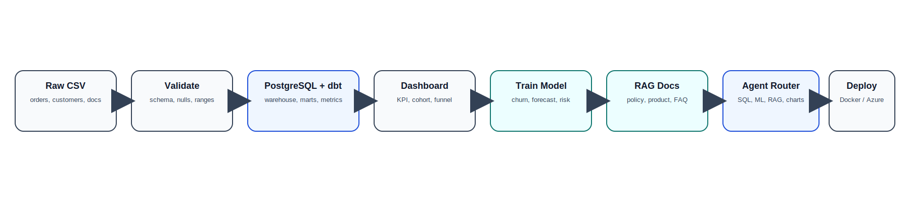

The flow is:

1. ingest CSV files
2. validate and clean them
3. load them to PostgreSQL
4. build dbt marts and dashboards
5. train a churn or forecasting model
6. ingest documents into RAG
7. let the agent choose SQL, ML, or RAG
8. deploy the full stack to Docker or Azure

## Tools

| Layer | Tools |
|---|---|
| Ingestion | FastAPI, Pandas, Polars, DuckDB |
| Storage | PostgreSQL, pgvector |
| Analytics | dbt, SQL, React, Recharts |
| ML | scikit-learn, XGBoost, MLflow, SHAP |
| GenAI | OpenAI or Azure OpenAI, Hugging Face embeddings |
| RAG | PyMuPDF, pdfplumber, pgvector |
| Agent | LangGraph, FastAPI, Redis |
| Ops | Docker, GitHub Actions, Azure |

## Alternatives

| Decision | Primary Choice | Alternatives |
|---|---|---|
| Warehouse | PostgreSQL | DuckDB for local-only prototypes |
| Dashboard UI | React | Power BI or Tableau |
| Model | XGBoost churn baseline | logistic regression, random forest |
| Retrieval | pgvector | Qdrant, Pinecone |
| Agent | LangGraph | custom router, Semantic Kernel |

## Implementation Guide

### Stage 1: Ingest the CSV Files

1. Create upload endpoints.
2. Store raw files and metadata.
3. Infer schema.
4. Validate required columns.
5. Produce a quality report.

Deliverable:

- a dataset record in PostgreSQL
- a validation report in the UI

### Stage 2: Build Analytics Tables

1. Load clean data into the warehouse.
2. Create staging models in dbt.
3. Create marts for customers, orders, products, and campaigns.
4. Define metrics such as revenue, AOV, retention, and conversion.

Deliverable:

- a dashboard with trusted metrics

### Stage 3: Train the First Model

1. Define churn in a time window.
2. Build features from the observation window.
3. Split by time, not randomly.
4. Train a baseline model.
5. Log metrics and artifacts in MLflow.
6. Explain top drivers with SHAP.

Deliverable:

- a churn risk score and explanation panel

### Stage 4: Add RAG

1. Parse support and policy documents.
2. Chunk the text.
3. Generate embeddings.
4. Store chunks in pgvector.
5. Retrieve and cite relevant chunks.

Deliverable:

- document-backed answers with citations

### Stage 5: Add the Agent

1. Create a tool registry.
2. Add SQL tool for metrics.
3. Add ML tool for prediction.
4. Add RAG tool for policy questions.
5. Add chart tool for visual output.
6. Route simple requests to the right tool.

Deliverable:

- one chat interface that can answer with SQL, ML, or RAG

### Stage 6: Deploy

1. Containerize backend and frontend.
2. Start the local stack with Docker Compose.
3. Push images to the registry.
4. Deploy to Azure.
5. Add monitoring and logs.

Deliverable:

- a working environment that other people can use

## Demo Script

Use this flow in a portfolio demo:

1. Upload a retail CSV file.
2. Show the data quality report.
3. Open the KPI dashboard.
4. Show a churn score.
5. Ask a question about a policy document.
6. Show a cited answer.
7. Ask the agent a question that requires SQL and RAG.
8. Show the agent choosing tools.
9. Show the deployment diagram.

## Best Practices

- Keep each stage working before adding the next one.
- Do not skip analytics and jump straight to the LLM.
- Use one domain pack first.
- Keep the sample dataset small.
- Reuse the same entity names across UI, database, ML, and RAG.
- Save screenshots and notes for the final demo.

## Common Mistakes

- Building the agent before the metrics layer exists.
- Training a model before data quality is checked.
- Using the same prompt for every domain.
- Putting all logic into one giant endpoint.
- Trying to support every domain at once.

## Interview Questions

1. Why did you choose retail for the worked example?
2. How does the CSV become a dashboard?
3. Where does the ML model fit in the flow?
4. Why do you add RAG before the agent?
5. How do you show the same architecture working in another domain?

## Learning Resources

Study:

- CSV ingestion patterns
- dbt model design
- churn modeling
- pgvector retrieval
- LangGraph routing
- Docker and Azure deployment

## Deliverables

- sample retail datasets
- quality reports
- dbt marts
- KPI dashboard
- churn model
- RAG answer endpoint
- agent workflow
- deployment runbook
- demo script

---

# Appendix J: Temporal Workflow Engine

## Purpose

Temporal is a durable workflow engine for long-running processes that need retries, state, approvals, and recovery after failures.

If the platform needs a workflow that must survive process restarts, network failures, or human approval delays, Temporal is the right tool. It is not just another queue.

## Business Importance

Enterprise AI systems are not one-shot requests. They often need to:

- ingest a file
- validate it
- ask for approval
- run embeddings
- trigger model training
- wait for a human decision
- retry safely if something fails
- continue later without losing state

Temporal makes that possible in a controlled way.

## Real-World Examples

- a document onboarding workflow pauses for legal approval
- a model promotion workflow waits for an evaluation gate
- a long-running extraction job retries after a worker crash
- a multi-step agent workflow resumes after a human answer
- a data remediation workflow keeps track of progress across hours or days

## Concepts

### Workflow

A workflow is the durable orchestration definition. It describes the sequence and logic, but should not perform direct side effects.

### Activity

An activity is the actual work: database writes, API calls, file parsing, embedding generation, or model scoring.

### Worker

A worker runs activities and executes workflow code.

### Task Queue

Task queues route workflow and activity tasks to workers.

### Signals

Signals are external messages that can resume or modify a running workflow, such as human approval.

### Queries

Queries let the UI inspect workflow state without changing it.

### Determinism

Temporal workflows must be deterministic. The same workflow code and event history should always lead to the same control flow.

### Idempotency

Activities should be safe to retry without corrupting data or duplicating side effects.

### Compensation

Compensation is the clean-up step for an action that must be reversed if later steps fail.

## Architecture

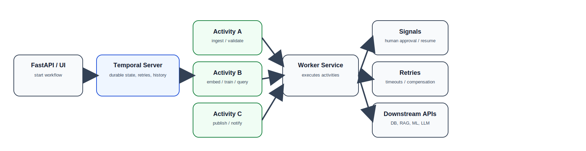

Temporal fits in this platform when the process is:

1. triggered by a user or system event
2. longer than a simple HTTP request
3. broken into multiple steps
4. likely to fail or wait for approval
5. important enough to trace and audit

## When to Use Temporal

| Use Case | Temporal? | Why |
|---|---|---|
| Dataset upload and approval | Yes | Needs retries and human gates. |
| Document ingestion and reindexing | Yes | Long-running multi-step workflow. |
| Model promotion and rollback | Yes | Requires audit trail and approval. |
| Nightly KPI refresh | Usually no | Prefect or Airflow is simpler. |
| Simple email notification | Usually no | A light background job is enough. |
| One-off SQL query | No | Synchronous API call is enough. |

## Tools

| Tool | Purpose |
|---|---|
| Temporal | Durable workflow orchestration. |
| Temporal Python SDK | Define workflows and activities in Python. |
| FastAPI | Start workflows from API requests. |
| PostgreSQL | Store business records and workflow-linked metadata. |
| Redis | Optional cache or short-lived state. |
| Docker Compose | Run Temporal locally during development. |

## Alternatives

| Need | Primary | Alternatives |
|---|---|---|
| Long-running durable workflows | Temporal | custom state machine, Camunda |
| Scheduled data pipelines | Prefect | Airflow, Dagster |
| Simple async jobs | Celery | RQ, Dramatiq |

## Implementation Guide

### One Good First Workflow

Start with document onboarding or dataset onboarding.

Example flow:

1. user uploads file
2. workflow records upload metadata
3. activity validates schema
4. activity profiles data quality
5. workflow waits for approval if quality is poor
6. activity loads cleaned rows
7. activity triggers embeddings or model training
8. activity notifies the user

### Build Steps

1. Install the Temporal Python SDK.
2. Start a local Temporal server in Docker Compose.
3. Define a workflow class.
4. Define activities for each side-effecting operation.
5. Start a worker process.
6. Start workflows from the FastAPI backend.
7. Add signals for human approval.
8. Add queries for progress reporting.
9. Add retries and timeouts.
10. Add workflow tests.

### What Not to Put Inside a Workflow

Do not put direct side effects in workflow code:

- no direct DB writes
- no direct HTTP calls
- no direct file manipulation
- no direct LLM calls

Keep those actions in activities.

## Best Practices

- Make activities idempotent.
- Keep workflows deterministic.
- Use signals for human approval.
- Use queries for UI status.
- Version workflow code carefully.
- Add timeouts and retry policies.
- Keep workflow state small and explicit.

## Common Mistakes

- Using Temporal like a normal queue only.
- Putting API calls inside workflow code.
- Ignoring idempotency.
- Not modelling failure paths.
- Using Temporal for a task that should just be a function call.
- Mixing workflow state with ad hoc global variables.

## Interview Questions

1. What is the difference between a workflow and an activity?
2. Why does Temporal need deterministic workflows?
3. When would you use signals?
4. How is Temporal different from Celery?
5. Why is Temporal useful for AI approval workflows?

## Learning Resources

Study:

- Temporal workflow basics
- Temporal Python SDK
- workflow determinism
- idempotent activity design
- retries and compensation
- human-in-the-loop orchestration

## Deliverables

- one Temporal workflow
- activity implementations
- worker service
- workflow status query
- approval signal handler
- retry and timeout policy
- workflow test suite
